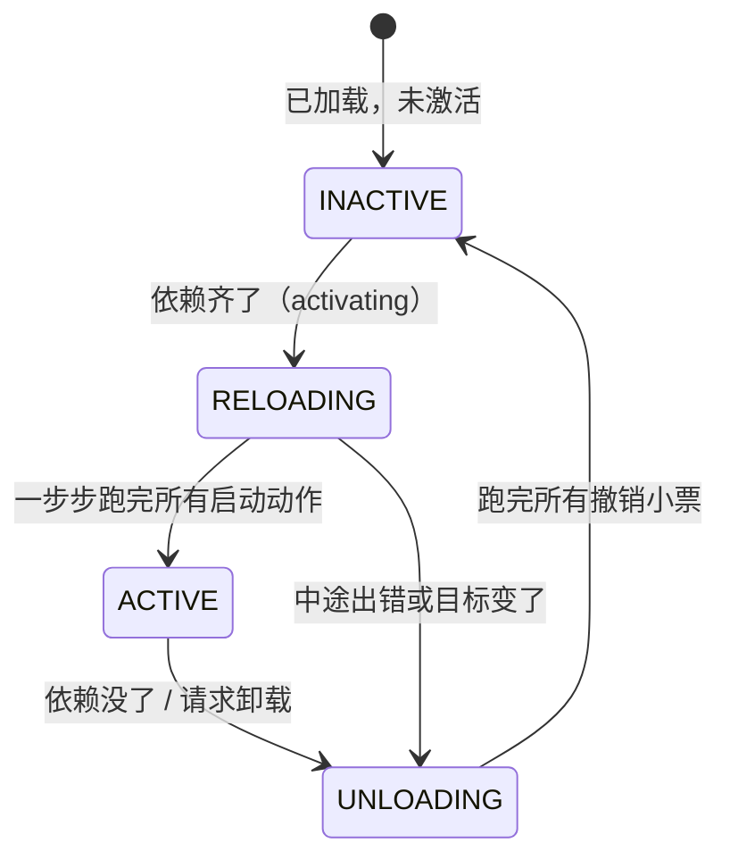

# 让插件像乐高一样装卸

## 0. 这篇论文到底想解决什么问题？

你写过带插件的系统吧？比如一个 Node.js 服务，运行中想：

*   装一个新插件（加载一段代码）
*   卸一个插件（把它的代码和影响清掉）
*   换一个插件的版本（热更新）

现实中的做法是啥？**重启进程**。 VSCode 禁用一个扩展都要重启窗口。为什么？因为插件运行时干了太多事：

```javascript
// 某个插件运行起来后做了这些事：
app.use('/api', routes);        // 注册了路由
db.connect();                    // 开了数据库连接
setInterval(sync, 1000);         // 起了定时器
emitter.on('msg', handler);      // 挂了事件监听
globalCache.set('foo', bar);     // 写了共享状态
```

现在要把这个插件卸载。问题来了：定时器关了吗？事件解绑了吗？连接断了吗？路由删了吗？

插件作者如果忘了写清理代码，这些东西就泄漏了——进程越跑越慢。

这就是论文说的**时间维（temporal）**问题：插件离场时，它对环境做过的所有修改，能不能被干净地全部撤销？

还有第二个问题。插件之间会互相依赖：

```javascript
// 插件 B 依赖插件 A 提供的"数据库服务"
const db = ctx.get('database');  // A 不在，这一行就崩
```

如果 A 还没加载、或者中途挂了、或者被卸载了，B 该怎么办？手动写一堆 `if (!db) { ... }` 和事件回调？

这就是论文说的**空间维（spatial）**问题：依赖能不能被声明出来，由系统自动接线、依赖变化时自动调整？

论文的全部野心就一句话：**让"装插件、卸插件、换插件"像插拔 U 盘一样安全，不用重启，也不会留下垃圾。** 而且它不是拍脑袋说"我行"，而是给出了数学证明。

---

## 1. 时间维：可逆 effect —— "每做一次改动，就交出一张撤销小票"

### 1.1 核心思想（一个比喻）

想象你是一家店铺的收银员，店规只有一条：

*   每收一笔钱，必须立刻开一张"退款单"；每张退款单都钉在一个板子上，按开单顺序排好。

*   插件做的每个改动操作（注册路由、开连接、起定时器） = 收一笔钱
*   配套交出的撤销操作（注销路由、断连接、清定时器） = 退款单
*   系统把退款单按顺序钉在板子上 = track（追踪）
*   卸载插件 = 把板子上的退款单从后往前逐张执行 = recover（恢复）

卸载因此变得机械而可靠：不需要插件作者"记得清理"，因为清理代码和动作代码必须成对交上来，少交系统就不让你做这个动作。

### 1.2 论文的公式在说什么人话

论文把上面这件事写成了数学。我们逐个符号看：

#### 1.2.1 第一个公式：什么是 effect

$$f : \Gamma \to \Gamma$$

*   $\Gamma$（读作 Gamma）：环境 / 上下文——就是系统当前的全部共享状态（注册了哪些路由、开着哪些连接、有哪些变量）。你可以把它想成一个巨大的 JS 对象。
*   $\to$：函数箭头，左边是输入类型，右边是输出类型。
*   $f$：一个改动操作。

**整句人话：** 一个 effect 就是一个函数，接收旧环境，返回新环境。就是：

```javascript
// f: 把"环境"改掉，返回改完后的环境
function registerRoute(env, path, handler) {
  env.routes[path] = handler;   // 改环境
  return env;
}
```

#### 1.2.2 第二个公式：改动操作 + 撤销操作，一个二元组，构成了一个"可撤销的改动方案"

$$(f, g)$$

*   $f$：正向改动操作，是一个 $\Gamma \to \Gamma$。
*   $g$：撤销操作，也是一个 $\Gamma \to \Gamma$。

> f 和 g，在 JavaScript 中对应的就是函数。

注意：论文只要求 $g$ 是 $f$ 的**左逆**：$g \circ f = \mathrm{id}$。

$g \circ f = \mathrm{id}$ 是什么意思？$\circ$ 是函数复合，$(g \circ f)(x)$ 就是 JS 里的 `g(f(x))`，$\mathrm{id}$ 是"什么都不做的函数"（`x => x`）。所以：

看一下 `\circ` (函数复合) 在 javascript 中是如何表示的。

```javascript 
// 1. 普通的函数复合（操作的是“裸函数”）
function compose(f, g) {
    // 返回一个新的函数，而不是直接执行
    return (x) => g(f(x)); 
}

// g 是 f 的左逆：g ∘ f = id
// 在 JS 中表现为：compose(f, g)(env) === g(f(env)) === env 
// 含义：g 撤销了 f，环境回到原样
```

为什么不要求反过来 $f(g(x)) = x$（右逆）也成立？因为现实里很多操作撤销后回不到字面意义上的原样——比如 `malloc` 了一块内存再 `free`，内存是还了，但 OS 整体内存布局不是原来那个样子。论文很务实：只要你撤销之后，站在"使用者"的角度看一切照旧，就算合格。（这个"使用者角度"后面 §4 还会展开，先记住。）


**【关键澄清】：操作函数不是方案，函数二元组才是方案**

*   单独的 $f$ 只是一个"改动操作"——它改变环境，但系统拿到它会恐慌："你改了环境，万一要卸载，我拿什么还原？"
*   单独的 $g$ 只是一个"撤销操作"——没有 $f$ 在前面制造改变，$g$ 毫无用武之地。
*   **只有 $(f, g)$ 这个二元组，才构成一个完整的、可逆的改动方案。** 它向系统承诺："我不仅要改变世界（$f$），还保证能把我改变的世界完美还原（$g$）。" 在系统的类型定义中，可逆 effect 的最小原子单位就是这个二元组。

#### 1.2.3 第三个公式：pair 的复合 —— 把"两步小的改动方案"打包成"一个大的改动方案"

$$(f_1, g_1) \circ (f_2, g_2) := (f_1 \circ f_2, g_2 \circ g_1)$$

$:=$ 表示"定义为"。

**【核心澄清】：这个公式本身执行了操作吗？**

**绝对没有。** 就像 $2 + 2 := 4$ 只是定义了加法规则，并没有真的去拿苹果。这个公式只是一个**静态的代数定义**，它规定了：如果你手里有两个"可逆的改动方案"（二元组），系统应该如何把它们**揉成一个总的"大改动方案"**。

**注意： 这里的 $\circ$ 是定义在二元组上的复合操作，和前面定义在 f 函数和 g 函数上的复合操作是不同的**。 

`compose(f, g)` 不能直接套用到 `(f1, g1) ∘ (f2, g2)` 上，因为 `compose` 的函数参数必须是“裸函数”，而 `(f1, g1)` 和 `(f2, g2)` 是**二元组**，参数类型不同！如果强行写 `compose((f1, g1), (f2, g2))`，JS 引擎会直接报错。这就好比你买了一个“榨汁机（compose）”，它只能处理“水果（裸函数）”，但你却往里塞了两个“装满水果的篮子（二元组）”，机器当然没法直接运转。

这里的 $\circ$ 复合操作，接收两个二元组，吐出一个新的二元组。我们用一个**JS 高阶函数**来模拟它：

```javascript
// ==========================================
// 2. 二元组的复合（操作的是“二元组”）
// ==========================================
function composePair(pair1, pair2) {
  // 【第 1 步：拆篮子】
  const [f1, g1] = pair1; // 拆开第一个方案
  const [f2, g2] = pair2; // 拆开第二个方案

  // 【第 2 步：对里面的“裸函数”分别使用普通的 compose】
  
  // 正向部分：数学上是 f1 ∘ f2
  // 套用普通 compose：先执行 f2，再执行 f1
  const newF = compose(f2, f1); 
  
  // 逆向部分：数学上是 g2 ∘ g1 （注意：为了保证 LIFO，这里顺序反过来了！）
  // 套用普通 compose：先执行 g1，再执行 g2
  const newG = compose(g1, g2); 

  // 【第 3 步：重新装进新篮子】
  return [newF, newG]; // 返回一个全新的二元组（大方案）
}
```

注意：`composePair` 只是把函数嵌套在了一起（形成了闭包），**此时没有任何副作用发生**。

**人话拆解（静态打包 vs 动态效果）：**

假设你有两个改动方案：
*   **方案 A**：正向做 $f_A$，撤销用 $g_A$（先做的）
*   **方案 B**：正向做 $f_B$，撤销用 $g_B$（后做的）

这个公式告诉你，打包后的"大方案"长什么样：正向部分是 $f_B \circ f_A$，撤销部分是 $g_A \circ g_B$。

**那"倒着叠（LIFO）"的效果是怎么来的？**

这来自于**未来调用这个大方案时**，数学上函数复合 $\circ$ 的**求值规则（从右向左）**：

1.  **正向执行时（计算 $f_B \circ f_A$）**：数学规定先算右边的，再算左边的。所以表现为：**先执行 $f_A$，再执行 $f_B$**。
2.  **逆向撤销时（计算 $g_A \circ g_B$）**：同理，先算右边的 $g_B$，再算左边的 $g_A$。表现为：**先撤销方案 B（$g_B$），再撤销方案 A（$g_A$）**。

**奇迹出现了**：方案 A 是先做的，方案 B 是后做的。但在撤销时，先执行了 $g_B$（撤销后做的），后执行了 $g_A$（撤销先做的）。这完美实现了"后做的先撤销"（LIFO，后进先出），和撤销小票"最后钉上去的最先撕"在逻辑上完全同构。

```javascript
// 假设我们按时间顺序，先制定了方案 A，后制定了方案 B
const planA = { forward: fA, backward: gA }; // 先做的方案
const planB = { forward: fB, backward: gB }; // 后做的方案

// 【静态打包】：把 A 和 B 复合成一个总方案
// 为了"先执行 A，再执行 B"，A 必须放在复合的右边
const combinedForward  = (env) => planB.forward(planA.forward(env));   // fB ∘ fA
const combinedBackward = (env) => planA.backward(planB.backward(env)); // gA ∘ gB

// 【动态执行】：当系统最终调用 combinedBackward 进行撤销时
// JS 的函数求值顺序是"从内到外"：
// 1. 先计算最内层的 planB.backward(env)  -> 撤销 B (后做的，最先撤！✅)
// 2. 再计算外层的 planA.backward(...)    -> 撤销 A (先做的，最后撤！✅)
```

**总结：** 公式本身只是在**定义打包规则**。而"后进先出（LIFO）"的撤销效果，是这套打包规则在**被 JS 引擎从内向外求值时**，自然产生的数学必然结果。

#### 1.2.4 第四个公式：effect context —— 自带“时光倒流”能力的超级上下文

$$\partial\Gamma := \Gamma \times (\Gamma \to \Gamma)$$

别被符号吓到，其实很好理解的。

**符号拆解：**
*   $\partial\Gamma$（读作 "partial Gamma"）：论文发明的一种新类型，叫 effect context，表示自带“时光倒流”能力的超级上下文。
*   $\times$：是两个类型之间的**笛卡尔积（Cartesian Product）**。`A × B` 在类型论里就是"一个二元组类型，其中第一个元素是 A 类型，第二个元素是 B 类型" —— 在 Typescript 中，可以用 `type Pair = [a: A, b: B]` 来表示。

所以，$\partial\Gamma := \Gamma \times (\Gamma \to \Gamma)$ 这句话的数学本质就是：
> **effect context 的类型，是“环境类型 $\Gamma$”和“撤销操作类型 $(\Gamma \to \Gamma)$”的笛卡尔积。**

注意: 
> 其实这里的定义并不完整，为了解读方便我简化了一部分公式内容，以至于上面的公式没有反应 $\Gamma$ 和 $(\Gamma \to \Gamma)$ 的逻辑关系。

数学上的“笛卡尔积”，在 JavaScript 或 TypeScript 等编程语言中，我们通常不会去生成一个庞大的集合，而是直接用以下两种数据结构来表示这个“积”：

1. **二元组（Tuple）**：
   就像知识库中提到的，`A × B` 对应 JS 里的 `[a, b]`。
   ```javascript
   // 长度为 2 的数组，第一个元素是环境，第二个元素是撤销函数
   const effectContext = [ { routes: [] }, (env) => env ];
   ```

2. **包含两个属性的对象（Struct）**：
   为了代码可读性，我们更常把它写成具名属性的对象。
   ```javascript
   // 对象的两个属性，分别对应笛卡尔积的两个分量
   const effectContext = {
     gamma: { routes: [] },    // 对应 Γ
     phi: (env) => env         // 对应 (Γ → Γ)
   };
   ```

**（1）让人晕车的地方：这三个 $\Gamma$ 到底啥关系？**

数学公式为了简洁，用了同一个符号 $\Gamma$ 来表示"环境"，但它**省略了时间维度**。实际上，这三个 $\Gamma$ 代表的是**同一个环境在时间线上的三个不同瞬间**。我们把 $\Gamma$ 想象成 **"一个房间的状态"**：

1.  **第一个 $\Gamma$（乘号左边）："当前"的房间状态**
    *   **含义**：插件做完一系列改动操作后，系统**此时此刻**的真实环境。
    *   **比喻**：你走进房间，看到桌上多了一个杯子（这是插件留下的痕迹）。
2.  **第二个 $\Gamma$（箭头 $\to$ 的左边）：撤销操作接收的输入**
    *   **含义**：当你决定卸载插件时，你把这个"当前被污染的房间"交给了撤销操作。
    *   **比喻**：清洁工（撤销操作）进门时，看到的正是那个"桌上有个杯子"的房间（接手烂摊子）。
3.  **第三个 $\Gamma$（箭头 $\to$ 的右边）：撤销操作产出的输出**
    *   **含义**：撤销操作执行完毕后，归还给系统的那个"干净、恢复原样"的环境。
    *   **比喻**：清洁工干完活离开后，房间恢复了"桌上没有杯子"的初始状态（干净的过去）。

**人话总结：**

effect context 就是一个二元组（存档槽），记作 $(\gamma, \varphi)$：
*   $\gamma$：**当前环境状态**。
*   $\varphi$（读作 phi）：**撤销累积器**。它的初值是"什么都不做"（$\mathrm{id}$，即 `x => x`）。因为在你还没做任何改动时，如果要求你"撤销"，那当然就是"保持原样，什么都不用干"。

需要注意的是：
> 在原论文的完整语境中，**$\partial\Gamma$ 并不是指这个笛卡尔积里的“所有”组合，而是指其中“满足特定不变量（Invariant）”的合法组合的集合。** 换句话说，$\partial\Gamma$ 是 $\Gamma \times (\Gamma \to \Gamma)$ 的一个**子集**。
只有当 $\varphi$ 确实是 $\gamma$ 的合法撤销链时，$(\gamma, \varphi)$ 才属于 $\partial\Gamma$。

**（2）Effect Context ($\partial\Gamma$) 的作用是什么？**

普通的 Context（上下文）只关心“现在是什么样”。
而 **Effect Context（$\partial\Gamma$）** 是一个被论文重新发明的、**自带“时光倒流”能力的超级上下文**，更准确地说，$\partial\Gamma$ 是“带有【撤销副作用能力】的上下文”。

一个生动的比喻：普通账本 vs Effect Context:

*   **普通的 Context** 就像一本**银行总帐账本**，它只反映一个时点的账户余额，而不反映一个时期的账户流水变化。
    *   你存了 100 块，账本上写着“余额 100”。
    *   你又取了 50 块，账本上写着“余额 50”。
    *   *问题*：如果现在系统要“回滚”到最初状态，账本只告诉你现在是 50，它**没有记录**你之前具体做了什么操作，你无法自动退回到 0。

*   **Effect Context ($\partial\Gamma$)** 就像一本**银行总账账本 + 一叠按顺序钉好的“退款单”凭证**。
    *   $\gamma$（当前状态）：账本显示“余额 50”。
    *   $\varphi$（撤销累积器）：钉在最上面的是“退还 30 块的指令”，下面压着的是“退还 100 块的指令”。
    *   *优势*：当系统调用 `recover` 时，它不需要猜，只需要从上往下撕退款单（执行 $\varphi$），就能**精确、机械地**把余额一步步退回到 0。

论文发明 $\partial\Gamma$ (effect context) 的根本目的，是为了**把“副作用”从一种“不可控的破坏”，变成一种“可追踪、可逆转的契约”**。

在 Cordis 框架中，这个 $\partial\Gamma$ 就具象化为那个无所不包的 `ctx` 对象。只要你通过 `ctx.effect()` 做的任何改动（副作用），系统都会强制你交出一张“撤销小票”，并把它塞进这个 effect context 的 $\varphi$（累积器）里。

从此，**“卸载插件能卸干净”不再是靠程序员的良心和记忆力，而是变成了系统底层数据结构（$\partial\Gamma$）的数学保证。**

**（3）用 TypeScript 代码"翻译"这个公式：**

```typescript
// 假设 Γ (Gamma) 是系统环境的类型
type Gamma = {
  routes: string[];
  timers: number[];
};

// 那么 ∂Γ (Effect Context) 的类型就是：
type EffectContext = [
  Gamma,                      // 第一个 Γ：当前的环境状态
  (env: Gamma) => Gamma       // (第二个 Γ) => (第三个 Γ)：撤销操作
];

// 实际运行时的样子：
const context: EffectContext = [
  { routes: ['/a'], timers: [123] }, // 1. 当前状态（被插件修改过）
  (currentEnv) => {                  // 2. 接收当前状态作为输入
    // ... 执行清理逻辑，比如删除 '/a'，清除定时器 123
    return cleanedEnv;               // 3. 返回恢复干净后的状态
  }
];
```

**（4）"累积器"是什么？（见证套娃魔法）**

因为每做一个新动作，$\varphi$ 就会像俄罗斯套娃一样，把**旧的累积器包在外面，新的撤销操作放在里面**。在 JS 中，函数求值是从内到外的。这意味着**放在最内层的新撤销操作，会最先被执行**，完美实现了"后做的先撤"（LIFO）。

```javascript
// 用 JS 演示 effect context 的"撤销链"演变过程：

// 1. 初始状态：插件还没开始做任何事
let gamma = { routes: [] };
let phi = (env) => env; // φ₀：撤销累积器，初值是"什么都不做"

// ==========================================
// 2. 插件执行第一个改动操作：注册路由 '/a'
// ==========================================
const undoA = (env) => {
  env.routes = env.routes.filter(r => r !== '/a');
  return env;
};
// 【关键】数学公式：φ₁ = φ₀ ∘ undoA
// 旧的 phi 作为外层函数，包裹着新的 undoA（内层函数）。
// 这样调用时，最内层的 undoA 会最先被求值执行，实现"后做的先撤"！
let phi_1 = (env) => phi(undoA(env)); 
gamma = { routes: ['/a'] };

// ==========================================
// 3. 插件执行第二个改动操作：注册路由 '/b'
// ==========================================
const undoB = (env) => {
  env.routes = env.routes.filter(r => r !== '/b');
  return env;
};
// 【关键】数学公式：φ₂ = φ₁ ∘ undoB
// 同样，新的 undoB 放在最内层（最先执行），旧的 phi_1 放在外层（后执行）
let phi_2 = (env) => phi_1(undoB(env));
gamma = { routes: ['/a', '/b'] };


// 💡 见证奇迹的时刻：把 phi_2 彻底展开，你会看到这个完美的嵌套结构：
// phi_2(gamma)  ===  phi( undoA( undoB(gamma) ) ) === { routes: [] }
// 
// JS 的函数求值顺序是"从内到外"（也就是数学复合的从右到左）：
// 
// 第 1 步：先执行最内层的 undoB(gamma)  -> 撤销 '/b' (后做的，最先撤！✅)
// 第 2 步：再执行中间层的 undoA(gamma)  -> 撤销 '/a' (先做的，后撤！✅)
// 第 3 步：最后执行最外层的 phi(gamma)   -> 初始的"什么都不做"，返回彻底干净的环境 { routes: [] }
```

#### 1.2.5 第五个公式：track —— 做改动的同时，把撤销小票钉上去

$$\mathrm{track}_\Gamma(f, g) = (\gamma, \varphi) \mapsto (f(\gamma), \varphi \circ g)$$

别被箭头和希腊字母吓到，`track` 本质上就是一个 **"记账员"函数**。它接收两样东西，吐出两样新东西。

**公式拆解：**

$$\mathrm{track}_\Gamma(f, g) = (\gamma, \varphi) \mapsto (f(\gamma), \varphi \circ g)$$

*   **$\mathrm{track}_\Gamma$**：这是我们要定义的**函数名称**。下标 $\Gamma$ 表示这个函数是泛型的，它操作的数据类型是环境 $\Gamma$。 `track` 本质上是一个**高阶函数（Higher-Order Function）**：它接收 $(f, g)$ 后，**返回**另一个函数，这个返回的函数才负责接收 $(\gamma, \varphi)$ 并计算出新结果。
*   **$(f, g)$**：这是函数的**第一组参数**。它是一个二元组（Pair），代表你提交的一个“可逆改动方案”（$f$ 是正向操作，$g$ 是撤销操作）。
*   **$=$**：表示“定义为”或“等价于”。意思是，等号左边的函数，其内部逻辑完全等同于等号右边的表达式。
*   **$(\gamma, \varphi)$**：这是函数的**第二组参数**（即映射的输入）。它也是一个二元组，代表当前的 effect context（$\gamma$ 是当前环境，$\varphi$ 是旧的撤销累积器）。
*   **$\mapsto$**：读作 **"maps to"（映射到）**。在数学中，它专门用来**描述函数内部的具体计算规则**（即输入是如何变成输出的）。
*   **$(f(\gamma), \varphi \circ g)$**：这是映射的**输出结果**（即函数的返回值）。它是一个全新的二元组，代表更新后的 effect context。

在数学和函数式编程中，等号右边 `(γ, φ) ↦ (...)` 其实就是一个**匿名函数**的定义。

很多初学者会混淆 $\to$ 和 $\mapsto$：
*   **$\to$ (如 $\Gamma \to \Gamma$)**：描述的是**类型（Type）**。意思是“这个函数吃进去一个 $\Gamma$，吐出来一个 $\Gamma$”。
*   **$\mapsto$ (如 $\gamma \mapsto f(\gamma)$)**：描述的是**计算规则（Rule）**。意思是“对于具体的输入值 $\gamma$，具体的计算动作是把它喂给函数 $f$”。

公式只是定义了 track ，并没有调用它。只有当调用 track 时：**f(γ) 才被真正执行**：

```javascript
// 这是调用（Invocation），不是定义（Definition）
// 在这一刻，`f(γ)` 才会被 JS 引擎真正求值，副作用才会真正发生（路由被注册、定时器被开启）。
const newContext = track(f, g, currentContext);
```

**人话翻译（记账员的两步操作）：**

当你调用 `track` 时，系统会严格按顺序做两件事：
1.  **改造环境**：用正向操作 $f$ 作用于当前环境 $\gamma$，得到被修改后的新环境 $f(\gamma)$。
2.  **更新撤销链**：把新的撤销操作 $g$ 和旧的累积器 $\varphi$ 组合起来，形成新的累积器 $\varphi \circ g$。

**关键：$\varphi \circ g$ 到底是谁先执行？**

回顾数学中函数复合的规则：$(\varphi \circ g)(x)$ 意味着**先执行右边的 $g$，再执行左边的 $\varphi$**。翻译成 JS 代码，就是：

```javascript
// 数学公式：φ ∘ g
// JS 翻译：旧的 phi 在外层，新的 g 在内层
const newPhi = (env) => phi(g(env)); 
```

在这个嵌套结构中，**新的撤销操作 $g$ 处于最内层，因此它会被最先执行**。旧的累积器 `phi` 包裹在外层，后执行。这完美保证了"后做的改动，最先被撤销"（LIFO，后进先出）。

**用 JS 完整实现这个"记账员"：**

```javascript
// track 函数的完整 JS 实现
function track(f, g, currentContext) {
  const { gamma, phi } = currentContext;

  // 1. 改造环境：执行正向操作 f
  const newGamma = f(gamma);

  // 2. 更新撤销链：新的 g 放在内层（先执行），旧的 phi 放在外层（后执行）
  // 对应数学公式：φ ∘ g
  const newPhi = (env) => phi(g(env));

  // 3. 返回全新的 effect context
  return {
    gamma: newGamma,
    phi: newPhi
  };
}
```

再给各高阶函数版的 `track` 的定义：

```javascript
// 数学公式：track_Γ(f, g) = (γ, φ) ↦ (f(γ), φ ∘ g)

// JS 高阶函数实现：
function track(f, g) {
  // 1. 外层函数接收 (f, g)，对应公式左边的 track_Γ(f, g)
  
  // 2. 返回一个映射函数，对应公式中的 ↦ (maps to)
  // 这个返回的函数接收当前的 effect context (γ, φ)
  return ({ gamma, phi }) => {
    
    // 3. 计算并返回新的二元组，对应公式右边的 (f(γ), φ ∘ g)
    return {
      // f(γ)：执行正向操作，得到新环境
      gamma: f(gamma),
      
      // φ ∘ g：数学上意味着先执行 g，再执行 φ
      // JS 中体现为将 g 放在内层，phi 放在外层
      phi: (env) => phi(g(env))
    };
  };
};
```

高阶函数，调用方式也会变得非常函数式（链式调用）：

```javascript
// 1. 定义环境类型 Γ (Gamma)
type Gamma = {
  routes: string[];
};

// 2. 定义 Effect Context 类型 ∂Γ
// 对应数学公式：Γ × (Γ → Γ)
type EffectContext = {
  gamma: Gamma;               // 第一个 Γ：当前的环境状态
  phi: (env: Gamma) => Gamma; // (Γ → Γ)：撤销累积器（接收旧环境，返回新环境）
};

// 3. 使用这个类型来标注 currentContext
const currentContext: EffectContext = {
  gamma: { routes: [] },
  phi: (env) => env // 初始的“什么都不做”
};

// 定义新的改动方案 (f, g)，f 和 g 函数的返回值是 Gamma 类型的对象
const f = (env) => ({ ...env, routes: [...env.routes, '/b'] });
const g = (env) => ({ ...env, routes: env.routes.filter(r => r !== '/b') });

// 调用方式：先传入方案生成转换器，再传入当前上下文执行转换
const newContext = track(f, g)(currentContext);

console.log(newContext.gamma.routes); // ['/b']
// currentContext 保持不变，newContext 是全新的状态
```

**关于 Thm.5（定理 5）：为什么论文要专门证明它？**

原文说："track 保持复合结构（先组合两个改动再 track，和分别 track 再组合，结果一样）"。

**人话解释：** 这证明了这套"记账系统"是**严丝合缝、没有逻辑漏洞**的。假设你有两个改动方案：方案 A 和方案 B。
*   **做法 1（分步记账）**：先 `track(A)`，再 `track(B)`。系统会生成一条撤销链：`先撤B，再撤A`。
*   **做法 2（合并记账）**：你先把 A 和 B 用第三个公式的 `compose` 打包成一个大方案 `C = compose(A, B)`，然后只 `track(C)` 一次。

Thm.5 用数学证明了：**做法 1 和做法 2 最终生成的"撤销链"和"环境状态"是一模一样的。** 这意味着，无论你是一个个插件慢慢装，还是把几个插件打包成一个大插件一次性装，系统都能保证卸载时能精准、一致地回滚到原点。这就是"一摞小票"模型在数学上的可靠性保证。

#### 1.2.6 第六个公式：recover —— 一键回滚，清空案发现场

$$\mathrm{recover}_\Gamma = (\gamma, \varphi) \mapsto (\varphi(\gamma), \mathrm{id}_\Gamma)$$

如果说 `track` 是"记账员"，那么 `recover` 就是终极的 **"清场指令"**。它接收当前的 effect context，吐出一个**被彻底洗干净**的新 context。

**公式拆解（输入与输出）：**
*   **输入：$(\gamma, \varphi)$** —— 当前的环境状态 $\gamma$（可能已经被插件改得面目全非），以及累积到现在的撤销链 $\varphi$（那个俄罗斯套娃）。
*   **输出：$(\varphi(\gamma), \mathrm{id}_\Gamma)$** —— 回滚后的全新 context。它包含两部分：
    1.  **$\varphi(\gamma)$**：把当前环境 $\gamma$ 喂给撤销链 $\varphi$。因为 $\varphi$ 内部已经按"后进先出 (LIFO)"的顺序编排好了所有清理动作，执行它，环境就会一层层剥开，变回最初始的干净状态。
    2.  **$\mathrm{id}_\Gamma$**：数学上的"恒等函数"（Identity function），在 JS 里就是 `env => env`（什么都不做）。意思是：既然已经回滚到起点了，撤销链也就完成了它的历史使命，被**彻底清空**，恢复成初始的"无事可做"状态。

**人话比喻：终极清洁**
*   $\gamma$ = 现在乱七八糟、堆满插件垃圾的房间。
*   $\varphi$ = 记录了所有清理步骤的"终极清洁指南"（套娃）。
*   $\varphi(\gamma)$ = 按照指南把房间彻底打扫干净后的结果。
*   $\mathrm{id}_\Gamma$ = 打扫完后，指南被扔进垃圾桶。下次再有人问"怎么清理？"，回答是："已经干净了，什么都不用做"。

**用 JS 代码"翻译"这个公式：**

```javascript
// recover 函数的完整 JS 实现
function recover(currentContext) {
  const { gamma, phi } = currentContext;

  // 1. 砸下累积器：把当前环境 gamma 喂给撤销链 phi
  // 这一步执行后，环境会经历 LIFO 的层层撤销，回到初始状态
  const cleanGamma = phi(gamma);

  // 2. 清空累积器：既然已经回滚到起点，撤销链就重置为"什么都不做"
  // 对应数学公式里的 id_Γ (恒等函数)
  const cleanPhi = (env) => env; 

  // 3. 返回彻底干净的全新 context
  return {
    gamma: cleanGamma,
    phi: cleanPhi
  };
}
```

`Cordis` 中就是用 `recover` 卸载单个插件的（虽然所有插件共享同一个 ctx，但每个插件的撤销链都是独立的，撤销时互不影响）。

**关于 Thm.7（定理 7）：为什么论文要专门证明它？**

原文说："只要每个原子操作给的撤销函数是对的，一键回滚后环境精确还原。"

**人话解释：** "套娃"听起来很美好，但数学上必须严谨证明：**如果每一步的撤销操作 $g$ 都是正向操作 $f$ 的真正左逆（即 $g(f(x)) = x$），那么把它们全部串起来执行，最终结果绝对等于"什么都没发生过"。**

Thm.7 就是这篇论文的"定海神针"。它用数学证明了：
> "卸载插件能卸干净"从此不再是"看插件作者有没有良心写清理代码"，也不是"靠测试用例碰运气"，而是**系统底层的数学保证**。只要你遵守规则交出了正确的撤销小票，系统就 100% 保证能把你带回原点，不留一丝垃圾。

### 1.3 用 JS 写一个迷你版（带注释）

下面这段代码实现了论文 §3.1 的核心机制，总共不到 40 行：

```javascript
/**
 * 迷你可逆 effect 系统 —— 论文 §3.1 的 JS 版
 * 核心不变量：每个改动操作，都必须交出配套的撤销操作
 */

// ── 环境：系统共享状态 ──────────────────────────────
// 对应论文的 Γ（Gamma）
const env = {
  routes: {},        // 已注册的路由
  timers: new Set(), // 存活的定时器
  listeners: {},     // 事件监听
};

// ── effect context：环境 + 撤销累积器 ──────────────
// 对应论文的 ∂Γ = Γ × (Γ→Γ)，记作 (γ, φ)
// phi 就是"撤销小票累积器"
const context = {
  gamma: env,                              // γ：当前环境
  phi: (gamma) => gamma,                   // φ：撤销累积器，初始为"什么都不做"
};

// ── track：做改动 + 钉小票 ─────────────────────────
// 对应论文的 track_Γ(f, g)
// f: 正向改动操作    g: 撤销操作（左逆，g(f(x)) === x）
function track(f, g) {
  // 1. 用 f 改造环境（正向）
  const newGamma = f(context.gamma);

  // 2. 把撤销操作 g 叠进累积器
  //    注意顺序：旧的 phi 包在外面，新的 g 在内层先执行 → 后注册的先撤销（LIFO）
  //    对应论文的 φ ∘ g
  const oldPhi = context.phi;
  context.phi = (gamma) => oldPhi(g(gamma));

  // 3. 更新环境
  context.gamma = newGamma;
}

// ── recover：一键回滚 ───────────────────────────────
// 对应论文的 recover_Γ
function recover() {
  context.gamma = context.phi(context.gamma); // 砸下累积器，回到起点
  context.phi = (gamma) => gamma;             // 清空累积器
}

// ═══ 使用示例：模拟一个"插件"的生命周期 ═══════════

// 插件的第一个改动操作：注册路由 /a
track(
  (env) => { env.routes['/a'] = () => 'hello A'; return env; },
  (env) => { delete env.routes['/a']; return env; }  // ← 配套的撤销操作
);

// ─────────────────────────────────────────────────
// 插件的第二个改动操作：起一个定时器
// 使用块级作用域 + 闭包，精确追踪"我自己"创建的那个定时器
// 这样撤销时只会清除自己的定时器，不会误杀其他插件的
// ─────────────────────────────────────────────────
{
  let myTimer;  // 闭包变量，只属于这一次 track 调用
  track(
    (env) => {
      myTimer = setInterval(() => {}, 1000);
      env.timers.add(myTimer);
      return env;
    },
    (env) => {                        
      clearInterval(myTimer);          // ✅ 只清除我自己的定时器
      env.timers.delete(myTimer);      // ✅ 只从全局集合中移除我自己的引用
      return env;
    }
  );
}

// 插件的第三个改动操作：注册路由 /b
track(
  (env) => { env.routes['/b'] = () => 'hello B'; return env; },
  (env) => { delete env.routes['/b']; return env; }
);

console.log(Object.keys(env.routes)); // ['/a', '/b']，环境被改了

// ── 卸载插件：一键回滚 ──────────────────────────────
recover();

console.log(Object.keys(env.routes)); // []  路由没了
console.log(env.timers.size);         // 0   定时器关了
// 环境精确回到插件加载之前的样子 ✔
```

注意代码里最关键的设计：`track` 的签名强制你传两个函数——正向和逆向。你想注册路由？先把"注销路由"交出来。这就是论文把"清理"从"作者自觉"变成"系统强制"的方式。

### 1.4 真实的并发问题：多个插件同时在场怎么办？

上面只处理了一个插件"自己撤自己"。现实更复杂：插件 B 的改动可能插在插件 A 的两个改动之间。A 卸载时，它的撤销操作跑在一个"被 B 动过"的环境上——还能撤干净吗？

论文的答案是：如果 A 和 B 的改动互相独立（可交换），就能。

这里要特别注意符号含义的变化。在 Def.19（独立性）中，公式里的 $f$ 和 $g$ **不再是** §1.2 里同一个插件内部的“正向和撤销”搭档，而是**分别来自插件 A 和插件 B 的操作函数**（包含它们各自的正向操作和撤销操作）。

独立的形式化定义（Def.19）要求 A 和 B 必须满足两个条件：

**条件一：跨插件的两两操作满足交换律（$f \circ g = g \circ f$）**
这意味着 A 的**每一个**操作函数（正向/逆向）和 B 的**每一个**操作函数，无论谁先执行，结果（ $\Gamma$ ）都一样。具体来说，必须两两配对检查以下 4 种组合：
1. A 的**正向**操作 与 B 的**正向**操作（先装 A 还是先装 B，结果一样）
2. A 的**正向**操作 与 B 的**撤销**操作（装 A 和卸 B 互不干扰）
3. A 的**撤销**操作 与 B 的**正向**操作（卸 A 和装 B 互不干扰）
4. A 的**撤销**操作 与 B 的**撤销**操作（先卸 A 还是先卸 B，结果一样）

**条件二：一方的改动不会“扰动”另一方的撤销操作（不误伤队友）**
这是最容易被忽略、也最关键的一点。它要求 A 的撤销代码在 B 已经存在的环境下执行时，必须**只清理 A 自己的垃圾，绝对不能误删 B 的东西**。

**这里比较 A 和 B 的操作函数的结果，不是指整个 `ctx`，而是 `ctx.gamma`（即 `env`）里面的数据。** 用“房间与记账本”的比喻来区分：

*   **$\Gamma$（环境状态 / `env`）** = **房间里的物理状态**（桌上有没有杯子、灯开没开）。
*   **$\varphi$（撤销累积器）** = **记账本上的流水记录**（“10:00 放了一个杯子”，“10:05 开了灯”）。
*   **$\partial\Gamma$（完整的 ctx）** = **房间状态 + 记账本**。

$f$ 和 $g$ 是“放杯子”、“开灯”的**动作**。
Def.19 的交换律 $f \circ g = g \circ f$ 问的是：**“先放杯子再开灯” 和 “先开灯再放杯子”，最后房间里的物理状态（$\Gamma$）是不是一模一样的？**

它**不关心**记账本（$\varphi$）上这两笔账的登记顺序有没有区别（实际上记账顺序肯定不同，因为 `track` 是后进先出的）。它只关心**最终呈现给使用者的物理状态**是否一致。

在程序角度上看：

*   ❌ **反面教材（会扰动/误伤）**：A 和 B 都往一个共享数组里 `push` 数据。A 的撤销操作写成了粗暴的 `pop()`（无脑弹出最后一个元素）。当 A 卸载执行 `pop()` 时，如果 B 已经执行了 `push`，A 就会把 B 的数据给弹出来！这就叫 A 扰动了 B。
*   ✅ **正面教材（不扰动/精确清理）**：A 的撤销操作通过闭包记住自己插入的具体数据，使用 `filter` 精确移除自己的数据。这样无论 B 怎么操作，A 卸载时都只删自己的，B 毫发无损。

**直觉例子：**
*   A 注册路由 `/a`，B 注册路由 `/b` → **独立**（两个不同的键，互不干扰，满足上述所有条件，随便什么顺序装卸都行）✔
*   A、B 都往同一个中间件链的头部插东西 → **不独立**（谁插前面，结果完全不同，不满足交换律）✘
*   A、B 都往同一个共享数组加数据，且撤销时都用 `pop()` → **不独立**（不满足“不扰动”条件，会误伤队友）✘

推论 Cor.21：一组两两独立的插件，卸载顺序随便排，环境都能精确还原。这就是"并发装卸是安全的"的数学依据。

## 2. 空间维：响应式 coeffect —— "厨师报菜，厨房喊开工"

### 2.1 核心思想（一个比喻）

把系统想成一间餐厅的后厨：

*   每个厨师（插件）上岗前要报菜单（coeffect specification）："我要有炉子、有食材才能开炒。"
*   厨房里有一块公共白板（coeffect context $\Sigma$）：炉子在不在、食材有没有，都写在上面。
*   系统安排一个传菜员盯着白板：
    *   厨师要的东西从缺到齐 → 喊他开工（activating）
    *   从齐到缺（炉子被搬走了）→ 喊他停工（deactivating）
    *   其他变化 → 不吭声（neutral）

插件作者只管"我需要什么"，完全不用写"等 A 加载完了我再初始化"这种胶水代码。依赖的满足与否，自动驱动插件的生死。

### 2.2 公式逐个讲

#### 第一个公式：coeffect context —— 一张"名字 → 服务"的表**

$$\Sigma := (k : K) \rightharpoonup \mathcal{V}_k$$

*   $\Sigma$（读作 Sigma）：coeffect context，就是那张白板。
*   $K$：所有"服务名"的集合，比如 `'database'`、`'logger'`、`'http'`。
*   $k$：其中某一个服务名。
*   $\rightharpoonup$：这个箭头读作"部分映射"——它是个函数，但只在一部分输入上有定义（不是每个服务名都有值）。
*   $\mathcal{V}_k$：服务名 $k$ 对应的值的类型。比如 `'database'` 对应一个数据库连接对象。

**人话：白板就是一个 Map，键是服务名，值是服务对象。但不是每个服务名都一定有值——服务可能还没被任何插件提供。换句话说，$\Sigma$ 就是一个部分 key 有对于 value 的 Map。** 

用 JS 表示就是：

```javascript
// Σ：一张部分映射表（对应论文的 Σ）
const board = new Map();
// board.get('database') 可能有值，也可能 undefined
```

#### 第二个公式：读依赖（依赖齐备性检查）

$$ \sigma \vDash d := \forall k \in d, k \in \mathrm{dom}(\sigma) $$

##### 1. 生活比喻：餐厅后厨的《设备登记表》
假设你是一个新来的厨师（**插件**），你要做一道菜，手里有一张 **《开工必备设备清单》 $d$**：
`d = ['烤箱', '打蛋器']`

厨房墙上有一块 **《当前可用设备登记表》 $\sigma$**。这张表是“键值对”形式的，不仅写了设备名字，还写了具体型号（值）：
```javascript
// 这就是 σ (当前的白板 / 完整的 Map)
const sigma = new Map([
  ['烤箱', '西门子型号X'],  
  ['搅拌机', '美的型号Y'],
  ['冰箱', '海尔双开门']
]);
```

现在，系统要检查 $\sigma \vDash d$（登记表是否满足你的清单），它会提取出登记表最左侧的 **“设备名称列”**，这就是 **$\mathrm{dom}(\sigma)$**：
```javascript
// 这就是 dom(σ) (白板上已登记的服务名集合 / Map 的 Key 集合)
const domSigma = ['烤箱', '搅拌机', '冰箱']; 
```
**系统检查员的操作步骤**：
1. **$\forall k \in d$（对于清单 $d$ 中的每一个名字 $k$）**：拿起清单上的 `'烤箱'`，再拿起 `'打蛋器'`。
2. **$k \in \mathrm{dom}(\sigma)$（这个名字 $k$，存在于登记表的“名称列”中吗？）**：
   - 问：`'烤箱'` 在 `['烤箱', '搅拌机', '冰箱']` 里吗？ 👉 **✅ 在 (True)**
   - 问：`'打蛋器'` 在 `['烤箱', '搅拌机', '冰箱']` 里吗？ 👉 **❌ 不在 (False)**
3. **结论 ($\vDash$ 满足)**：因为**不是所有**的 $k$ 都在 $\mathrm{dom}(\sigma)$ 中（打蛋器缺失），所以 $\sigma \vDash d$ 为 **False**。系统判定：厨师不能开工，继续等待 `'打蛋器'` 被登记到白板上。

##### 2. 数学符号逐字“人话”翻译

| 数学符号 | 读音/名称 | 人话翻译（对应上面的比喻） |
| :--- | :--- | :--- |
| $\sigma$ | Sigma | **当前的白板**。记录了现在系统里已经有哪些服务可用（包含具体的值）。 |
| $d$ | deps | **插件的依赖清单**。比如 `['database', 'logger']`。 |
| $\vDash$ | 满足 (models) | 一个判定动作，意思是“左边的环境，能否满足右边的需求”。 |
| $:=$ | 定义为 | 意思是“等号左边这个符号，它的具体含义就是等号右边这句话”。 |
| $\forall$ | 对于所有 (for all) | **挨个检查**。强调“清单里的**每一个**元素，都不能漏掉”。 |
| $k \in d$ | k 属于 d | 拿出清单 $d$ 里的某一个服务名，我们叫它 $k$（比如 $k$ = 'database'）。 |
| $\mathrm{dom}(\sigma)$ | sigma 的定义域 | **白板上已经登记的名字集合**。在 JS 的 `Map` 中，就是所有已经 `set` 过的 **Key 的集合**（不关心对应的 Value 是什么）。 |
| $k \in \mathrm{dom}(\sigma)$ | k 属于 dom(sigma) | 这个服务名 $k$，存在于白板的登记名单里吗？ |

**整句人话（直译）**：
“环境 $\sigma$ 满足需求 $d$” 定义为：对于需求清单 $d$ 中的**每一个**服务名 $k$，$k$ 都必须存在于白板 $\sigma$ 的已登记名字集合（$\mathrm{dom}$）中。

##### 3. JS 代码逐行对照

现在回头看这段 JS 代码，你会发现它和公式是**严丝合缝**的：

```javascript
// σ ⊨ d 的 JS 版
function satisfied(board, deps) {
  // 1. [...deps] 
  //    对应公式里的 "d" (依赖清单)。如果 deps 是个 Set，展开成数组方便遍历。
  
  // 2. .every(...) 
  //    对应公式里的 "∀" (对于所有)。
  //    every 的意思是：数组里的每一项都必须返回 true，整体才返回 true。
  
  // 3. k => board.has(k)
  //    对应公式里的 "k ∈ dom(σ)"。
  //    k 就是清单里的当前项。
  //    board.has(k) 就是在问：白板(board)的已登记名字集合(dom)里，有 k 吗？
  
  return [...deps].every(k => board.has(k)); 
}
```

##### 4. 为什么公式必须强调 $\mathrm{dom}(\sigma)$，而不是直接查 $\sigma$？

在插件系统中，区分 $\sigma$ 和 $\mathrm{dom}(\sigma)$ 有极其重要的工程意义：

- **依赖检查只看“名字”（Key），不看“实现”（Value）。**
  插件 A 声明需要 `'database'`，它只关心白板上**有没有** `'database'` 这个 Key（即 $k \in \mathrm{dom}(\sigma)$）。至于这个 `'database'` 对应的是 MySQL 还是 PostgreSQL（Value），插件 A 在依赖检查阶段根本不关心。那是它被激活后，调用 `ctx.get('database')` 时才去处理的事。
- **精准映射**：在 JS 中，`board.has(k)` 本质上就是在查询 Map 的 Domain（定义域/Key 集合），完美对应了数学上的 $k \in \mathrm{dom}(\sigma)$。

### 第三个公式：notify —— 三态通知（边缘触发与生命周期驱动）

$$ \mathrm{notify}_d(\sigma, \sigma') := \begin{cases} \text{activating} & \sigma \nvDash d \wedge \sigma' \vDash d \\ \text{deactivating} & \sigma \vDash d \wedge \sigma' \nvDash d \\ \text{neutral} & \text{其他情况} \end{cases} $$

#### 1. 生活比喻：传菜员的“盯梢”与“扣扳机”
延续我们后厨的比喻。厨师（插件）上岗前，向系统递交了一份**契约**，包含两样东西：
1. **《开工必备设备清单》**（对应代码里的 `inject: ['烤箱', '打蛋器']`）。
2. **《开工动作说明书》**（对应代码里的 `apply(ctx) { ... }`，注意：此时只是**定义**，并未执行）。

厨房里有一个传菜员（系统底层的 `notify` 机制），他手里拿着两张表：**旧白板 $\sigma$**（上一秒的设备登记表）和**新白板 $\sigma'$**（刚刚更新过的登记表）。
传菜员不关心白板上具体多了什么或少了什么，他**只关心一件事：厨师“能不能开工”的状态，有没有跨过临界线？**

- **情况一（Activating 激活 - 从缺到齐）**：
  - **旧白板 $\sigma$**：只有 `['烤箱']`。缺打蛋器，不满足（$\nvDash$）。
  - **新白板 $\sigma'$**：采购员刚把 `打蛋器` 登记上表。设备齐了，满足（$\vDash$）。
  - **传菜员动作**：状态从“不能”变成了“能” $\rightarrow$ 判定为 **`activating`**！
  - **框架扣动扳机**：系统收到信号，**亲自去调用厨师定义的 `apply(ctx)`**，厨师正式开工！

- **情况二（Deactivating 停用 - 从齐到缺）**：
  - **旧白板 $\sigma$**：有 `['烤箱', '打蛋器']`。厨师正在炒菜（满足 $\vDash$）。
  - **新白板 $\sigma'$**：烤箱突然短路被搬走维修了。缺烤箱，不满足（$\nvDash$）。
  - **传菜员动作**：状态从“能”变成了“不能” $\rightarrow$ 判定为 **`deactivating`**！
  - **框架扣动扳机**：系统立刻让插件停工，并**自动执行厨师之前交出的所有“撤销小票”**，清理案发现场。

- **情况三（Neutral 中立/无事发生 - 没跨过临界线）**：
  - **旧白板 $\sigma$**：只有 `['烤箱']`（不能开工）。
  - **新白板 $\sigma'$**：采购员买回了无关的 `['微波炉']`。依然缺打蛋器（还是不能开工）。
  - **传菜员动作**：以前不能做，现在还是不能做。状态没变 $\rightarrow$ 判定为 **`neutral`**。传菜员闭嘴，插件继续休眠，不受干扰。

#### 2. 数学符号“人话”翻译字典
公式里的分段函数 $\begin{cases} ... \end{cases}$ 其实就是编程里的 `if - else if - else`。我们逐个符号拆解：

| 数学符号 | 读音/含义 | JS 中的对应物 | 人话翻译 |
| :--- | :--- | :--- | :--- |
| $\mathrm{notify}_d(\sigma, \sigma')$ | 通知函数 | `function notify(deps, oldBoard, newBoard)` | 拿着清单 $d$，对比新旧两块白板，决定喊什么口号。 |
| $\sigma \nvDash d$ | 旧白板 **不满足** 需求 | `was === false` | 以前条件不具备（不能开工）。 |
| $\sigma' \vDash d$ | 新白板 **满足** 需求 | `is === true` | 现在条件具备了（能开工）。 |
| $\wedge$ | **并且** (逻辑与) | `&&` | 前后两个条件必须同时成立。 |
| $\text{其他情况}$ | 没发生上述两种极端翻转 | `else` | 要么一直满足，要么一直不满足。 |

**把第一行公式连起来读：**
$\sigma \nvDash d \wedge \sigma' \vDash d$ 
= "旧白板不满足" **并且** "新白板满足" 
= `was === false && is === true`（从缺到齐）

#### 3. JS 代码对照：从“纯函数”到“框架底层调用”
为了彻底解答 **“`notify` 在哪里？”** 以及 **“`apply(ctx)` 是怎么被调用的？”**，我们分两步来看代码：

**第一步：`notify` 纯函数（只负责判断状态翻转）**
```javascript
function notify(deps, oldBoard, newBoard) {
  // 调用上一个公式的 satisfied 函数
  const was = satisfied(oldBoard, deps); // 旧白板满足吗？(σ ⊨ d)
  const is  = satisfied(newBoard, deps); // 新白板满足吗？(σ' ⊨ d)
  
  if (!was && is)  return 'activating';    // 从缺到齐
  if (was && !is)  return 'deactivating';  // 从齐到缺
  return 'neutral';                        // 没变
}
```

**第二步：框架底层的“暗箱操作”（驱动生命周期）**
`notify` 本身只是个计算器，真正厉害的是**框架底层如何消费它的结果**。每次白板发生变化时，框架内部会自动运行这段逻辑：

```javascript
// 框架底层伪代码（每次白板更新时触发）
function onBoardChanged(oldBoard, newBoard, plugin) {
  // 1. 传菜员盯梢：计算三态通知
  const state = notify(plugin.inject, oldBoard, newBoard);
  
  // 2. 框架扣动扳机：根据通知结果，驱动插件生命周期
  if (state === 'activating' && !plugin.isActive) {
    plugin.isActive = true;
    // 💥 高潮：框架亲自调用你定义的 apply 函数！
    // 并传入带有“时光倒流”能力的超级上下文 ctx
    plugin.apply(superCtx); 
  } 
  else if (state === 'deactivating' && plugin.isActive) {
    plugin.isActive = false;
    // 🧹 框架自动执行清理：收回所有撤销小票，一键回滚
    superCtx.recover(); 
  }
  // neutral 情况下，框架什么都不做，插件保持原状
}
```

#### 4. 为什么这种设计极其优雅？（工程意义）

看懂了这个流程，你就会明白这篇论文最伟大的地方在于：**它把“空间维（依赖关系）”和“时间维（生命周期）”完美缝合了。**

**传统的插件开发（痛点：回调地狱）**
插件作者必须自己写一堆恶心的胶水代码去监听依赖，手动管理生死：
```javascript
// 传统写法：令人崩溃
on('serviceA_ready', () => {
  on('serviceB_ready', () => {
     startMyPlugin();
     on('serviceA_removed', () => stopMyPlugin()); // 还要手动写清理！
  })
})
```

**论文/Cordis 的插件开发（降维打击：声明式契约）**
插件作者**只负责声明（`inject`）**和**定义动作（`apply`）**。
```javascript
// 论文写法：极其清爽
const myPlugin = {
  inject: ['A', 'B'],      // 1. 递交清单 (d)
  apply(ctx) { ... }       // 2. 定义动作 (等待被调用)
}
```

**总结**：
`notify` 公式就像一个**边缘触发（Edge-triggered）** 的过滤器。它过滤掉了白板上所有无效的噪音（`neutral`），只在依赖状态发生**实质性翻转**的那一瞬间，精准地扣动扳机。
“什么时候调用 `apply`”、“依赖中途没了怎么清理”，这些极其复杂的逻辑，插件作者一行代码都不用写，全被论文里的 **$\vDash$ (满足公式)** 和 **$\mathrm{notify}$ (三态通知公式)** 在框架底层自动包揽了！

#### 第四个公式（全文最妙的一处接缝）：写依赖本身也是一个可逆 effect！**

$$\mathrm{set}(k, v) : \mathfrak{E}^*_\Sigma$$

$\mathfrak{E}^*$ 是 §1 里那个"带撤销小票的改动"的类型。

**人话：**往白板上写"我提供 database 服务"这件事，本身就是一个可逆 effect——它的撤销函数就是"从白板上擦掉这个服务"。所以 §1 和 §2 两套机制在这里自动对接了：插件提供服务和插件消费服务，用的是同一套"改动 + 撤销"机制。

### 2.3 用 JS 写一个迷你版

```javascript
/**
 * 迷你响应式 coeffect 系统 —— 论文 §3.2 的 JS 版
 * 插件只声明"我需要什么"，系统在白板变化时自动激活/停用
 */

// ── 白板：服务名 → 服务对象（对应论文的 Σ）─────────
// 注意：这是被所有插件共享的"环境"的一部分，
// 对它的每次修改都必须走可逆 effect（见下方 setService）
const board = new Map();          // σ：当前白板

// ── 插件表：所有已加载的插件 ──────────────────────
const plugins = new Map();        // name → plugin 定义

// ── 注册插件：声明依赖清单 d ──────────────────────
function definePlugin(name, deps, activate, deactivate) {
  plugins.set(name, { deps: new Set(deps), activate, deactivate, active: false });
}

// ── 核心：白板变化后，检查每个插件的满足状态 ──────
// 对应论文的 notify（Def.26）
function checkAll(oldBoard) {
  for (const [name, p] of plugins) {
    const was = [...p.deps].every(k => oldBoard.has(k)); // σ ⊨ d ?
    const is  = [...p.deps].every(k => board.has(k));    // σ' ⊨ d ?
    if (!was && is && !p.active) {
      // activating：从缺到齐 → 开工
      p.active = true;
      console.log(`[activating] ${name} 依赖齐了，开工`);
      p.activate();
    } else if (was && !is && p.active) {
      // deactivating：从齐到缺 → 停工（并撤销它的一切改动）
      p.active = false;
      console.log(`[deactivating] ${name} 依赖没了，停工`);
      p.deactivate();
    }
    // neutral：满足状态没变 → 什么都不做
  }
}

// ── 提供服务：可逆 effect（对应论文的 set(k,v)：ℰ*Σ）──
const disposers = new Map(); // 每个服务的"撤销小票"
function provideService(name, value) {
  const old = new Map(board);        // 旧白板 σ（快照）
  board.set(name, value);            // 正向：写上服务
  disposers.set(name, () => {        // 撤销小票：擦掉服务
    board.delete(name);
    checkAll(new Map(board).set(name, value)); // 用"擦掉前"的白板对比
  });
  checkAll(old);                     // 通知所有插件（用新旧白板对比）
}
function revokeService(name) {
  const undo = disposers.get(name);
  if (undo) undo();
}

// ═══ 使用示例 ═══════════════════════════════════════
definePlugin('db-driver', [], () => {
  console.log('  db-driver：连接数据库');
  provideService('database', { query: () => [] });
}, () => {
  console.log('  db-driver：断开数据库');
  revokeService('database');
});

definePlugin('user-api', ['database'], () => {
  console.log('  user-api：注册 /users 路由');
}, () => {
  console.log('  user-api：注销 /users 路由');
});

// 1. 先只加载驱动。user-api 的依赖 'database' 没人提供 → 保持休眠
console.log('--- 加载 db-driver ---');
const old1 = new Map(board);
board.set('boot', true); // 触发一次检查
plugins.get('db-driver').activate(); plugins.get('db-driver').active = true;

// 2. db-driver 提供 database 服务 → user-api 自动激活！
console.log('--- db-driver 开始提供 database ---');
provideService('database', { query: () => [] });

// 3. db-driver 被卸载、database 没了 → user-api 自动停用！
console.log('--- db-driver 被卸载 ---');
revokeService('database');

/**
 * 输出：
 * [activating] user-api 依赖齐了，开工      ← 全自动，user-api 作者什么都没写
 * [deactivating] user-api 依赖没了，停工     ← 也是全自动
 */
```

**重点体会：**`user-api` 的作者只写了"我需要 database"，从未写过一个回调去等 database。 激活和停用都是系统对着白板做差分后自动驱动的。

### 2.4 两个进阶概念（知道即可）

*   **isolation（隔离域，$\Sigma^{iso}$）**：同名的服务，在不同"房间"里可以是不同的东西。比如测试环境和生产环境各有一块白板。就像一个词"炉子"，中餐间和西餐间指的是不同的灶。实现上就是查表时多查一层：`key → 房间号 → 值`。
*   **interception（拦截，$\Sigma^{inter}$）**：不改服务本身，但给"某个插件怎么用这个服务"叠一层规则——比如给社区插件的数据库访问加只读限制。类比：经理不改菜谱，但规定"这道菜今天限量"。特点是不用改插件代码，由外层强制。

## 3. 统一上下文：把前两张表焊成一张

### 3.1 公式

$$\Gamma_\infty := \mu\Gamma. \Gamma \times (\Gamma \to \Gamma) \times \Sigma$$

这是全文看着最吓人的一个公式，拆开就三样：

*   $:=$ 定义；
*   $\Sigma$：刚讲的依赖白板；
*   $\times$：配对（前面说过，就是二元组）；
*   $\Gamma \times (\Gamma \to \Gamma)$：§1 的"环境 + 撤销累积器"；
*   $\mu\Gamma.$：读作"最小的、满足右边等式的 $\Gamma$"——数学上处理"自己定义自己"（递归类型）的标准记号。就是 JS 里的递归：

```javascript
// μΓ 的白话版：一个对象，它里面装着"它自己 + 一个改它自己的函数 + 白板"
// 【修正】JavaScript 中需要先创建对象，再赋值 self 属性，避免循环引用报错
const ctx = {};
ctx.self = ctx;        // ← Γ 递归地指向自己
ctx.undo = () => {};   // ← (Γ→Γ)：撤销累积器
ctx.board = new Map(); // ← Σ：依赖白板
```

**人话总结：**全系统只有一个统一对象 `ctx`，它同时装着〔当前状态〕、〔一摞撤销小票〕、〔依赖白板〕。 插件的所有交互都经过这一个对象，所以每次交互都能被追踪、被归因到具体插件。真实框架 Cordis 里的 `ctx` 就是这个 $\Gamma_\infty$ 的实现。

### 3.2 观察等价（observational equivalence）—— "查不出区别就算一样"

§1 说"撤销后环境要精确还原"，但现实中做不到字面意义的还原（内存布局变了）。论文的解法是放宽"相等"的定义：

**两个状态，只要没有任何使用者能查出区别，就算相等。**记作 $\simeq$（读作"波浪等于"）。

比喻：两本厚薄、排版都不同的字典，只要查任何一个词释义都一样，读者就无从分辨、可以当它们相等。

这个定义为什么关键？因为由此可以证明两条结构性定理：

*   **Thm.40**：动不同服务名的两个操作，天然独立（各写各的键，互不干扰）。
*   **Thm.42**：就算动同一个键，只要这个键上的操作可交换（比如"注册路由"——注册 `/a` 和注册 `/b` 谁先来结果一样），两个插件也独立。

而"独立"意味着什么？回到 §1.4：**独立的插件可以并发、可以任意顺序装卸。** 于是：

**用"空间维"的信息（插件动的键是否不同），解锁"时间维"的性质（卸载顺序随便排）。** ——这就是论文标题"时空可组合"（Spatiotemporal Composability）的由来。

一个反例帮你理解"不可交换"：两个插件都往同一条中间件链的头部插函数，谁先谁后结果完全不同——这种键就不可交换，顺序必须由别处强制。所以"哪些插件能随便并发"不是拍脑袋，而是可以对着服务键逐条检查出来的。

---

## 4. 组件生命周期：一台不会出错的状态机

前面都是"一个插件"的视角。这一节把许多插件放在一起，给每个运行中的插件实例（论文叫 fiber）配一台状态机。

### 4.1 白话版状态机



**四个状态的白话：**

| 状态 | 白话 |
| :--- | :--- |
| INACTIVE | 插件在内存里躺着，啥也没干 |
| RELOADING | 正在激活：逐步执行它的启动动作，每步的撤销小票同步累积 |
| ACTIVE | 正常工作，撤销小票摞好了，随时可以撤 |
| UNLOADING | 正在停用：执行撤销小票（后注册的先撤） |

**四个设计要点，每个都对应一个真实痛点：**

1.  **激活是"一步步"的，不是原子的**（对应论文 §4.3.2 Iteration）。启动动作可能有很多步，每步之间是个天然的检查点——中途发现"目标变了"（比如依赖突然没了），可以立刻掉头去卸载，已做的部分按小票回滚。
2.  **卸载拆成两步：先"停止提供服务"，再"动手清理"**（§4.3.1 Withdrawal）。为什么？因为插件 B 的收尾代码可能还需要用它依赖的服务（比如归还数据库连接）。如果 A 一被卸载就立刻断掉 `database`，B 的收尾就崩了。所以状态机保证：B 完全走完之后，A 才允许真正清理。 这个"等依赖者先走完"的守卫，论文叫 withdrawal guard。
3.  **正在进行的迁移必须跑完，不能半途切换**（§4.3.3 Asynchrony/"惯性"）。异步操作发起后，环境可能已经变了，但这条进行中的操作必须落地，然后再响应新目标——否则状态会错乱。就像已经端上桌的菜不能收回去重做，先上菜、再处理厨房的新指令。
4.  **失败了也要干净落地**（§4.3.4 Failure）。启动到一半出错（端口被占、文件不存在），不能留个烂摊子：已做的全部撤销，插件进入"失败态"并记录错误，不影响其他插件，也不无脑重试。

### 4.2 五条定理的白话版

论文给这套状态机证明了五条性质，每条翻成人话：

| 定理 | 人话 |
| :--- | :--- |
| **Preservation（Thm.59）** | 系统永远停在 "结构良好 "的状态里，不会某步之后进入莫名其妙的状态 |
| **Recovery exactness + Terminal recovery（Thm.61 + Cor.62）** | 插件退出后，它对世界的影响 **归零** ——环境回到它加载之前（在 "查不出区别 "的意义下） |
| **Ordering（Thm.63）** | 依赖者永远后激活、先停用；停用期间它依赖的服务全程可读 |
| **Progress（Thm.66）** | 只要依赖关系 **不成环** ，系统一定向前推进、最终安静下来（不会死锁）；守卫（等依赖者）一定会释放 |
| **Confluence（Thm.73）** | **最值钱的一条** ：无论插件装卸的顺序、并发如何，只要最终配置相同，系统安静下来后的状态就是同一个 |

**Confluence 意味着一件工程上极其爽的事：你可以把动态系统当静态系统推理。** 不用关心"先装 A 再装 B"和"先装 B 再装 A"有什么区别——没区别。系统最终长什么样，只取决于"最后装了哪些插件、什么配置"，不取决于历史。

前提要说清楚（论文很诚实）：Recovery 和 Confluence 要求插件们的改动两两独立，Progress 要求依赖不成环（A 依赖 B、B 又依赖 A 的话，两个会永远卡在 INACTIVE，好在加载时就能静态报出来）。

---

## 5. 落地：Cordis 框架和 Koishi

理论有了，代码在哪？**Cordis**（开源，TypeScript）就是这套理论的几乎逐行实现：

| 论文概念 | Cordis 代码 |
| :--- | :--- |
| $\Gamma_\infty$ 统一上下文 | `ctx` 对象 |
| 可逆 effect | `ctx.effect(callback)` —— 回调里 yield 出撤销函数 |
| 依赖白板 $\Sigma$ | `ctx.get(key)` / `ctx.set(key, value)` |
| 声明依赖 $d$ | 组件定义里的 `inject: ['database']` |
| fiber 状态机 | 每个插件实例的状态：`INACTIVE` / `LOADING` / `ACTIVE` / `UNLOADING` / `FAILED` |
| 拦截 / 隔离 | `ctx.intercept()` / `ctx.isolate()` |

实际用起来是这样的（简化示意）：

```typescript
// 定义一个组件：声明"我需要 logger"，提供"我的服务"
const myPlugin = {
  inject: ['logger'],                    // ← 依赖声明（论文的 d）
  apply(ctx) {                           // ← 激活时执行（论文的 effect iterator）
    ctx.effect(() => {                   // 每个改动包在可逆 effect 里
      const timer = setInterval(tick, 1000);
      return () => clearInterval(timer); // ← 撤销小票：卸载时自动执行
    });
    ctx.set('myservice', { ping() {} }); // 提供服务（自动可逆：卸载即移除）
  },
};

const fiber = ctx.use(myPlugin);  // 实例化 → 走状态机
// fiber.dispose() → 一键卸载：定时器关了、服务移除了，干干净净
```

**热更新（HMR）是这套理论白送的福利：**改代码保存后，旧插件实例 `dispose`（自动撤销一切）→ 用新代码实例化重装。对比 Webpack/Vite 的 HMR 需要开发者手写 `module.hot.accept(...)` 标注"哪些改动在哪里接住"，Cordis 不需要——因为每个插件的边界和撤销路径已经是系统强制的了。

**Koishi**（一个 4000+ 插件的开源聊天机器人框架）是生产验证：它的 web 控制台本身就是一个独立的 Cordis 应用。论文诚实声明：这是"存在性 + 被采用"的证据，不是和替代方案的受控对比实验。

---

## 6. 这套理论的边界（论文自己承认的坑）

*   **撤销函数对不对，运行时不管。**系统强制你"交撤销小票"，但小票内容对不对（真的撤干净了吗）是插件作者的责任。它是"结构性保证的前提是每个原子逆元正确"。
*   **跨边界的操作不算数。**已经发出的网络请求、已经发出去的邮件——这些没法撤销，只能"先扣着不发"（withhold）或"事后补偿"（compensation，比如再发一封"上封作废"）。
*   **内存里的状态默认活不过热更新。**卸载重装 = 回到干净状态重新来，旧实例的局部变量没了。想保留状态，得主动放进长寿的共享服务里。这一点对"AI agent 自我改写"这个头号动机其实是个待解的硬伤。
*   **依赖只按名字匹配，没有版本和类型检查。**`ctx.get('foo')` 拿到的 `foo` 是 1.0 还是 2.0 接口、兼不兼容，框架不管（目前靠 npm 的 peerDependencies 约定兜底）。
*   **循环依赖无解：**A 等 B、B 等 A，双双永远休眠（好在能在加载时静态检测并报错）。

---

## 7. 一页纸总结

*   **问题：**运行中装卸插件，传统做法只有重启；插件作者手写清理代码不可靠（VSCode 前 100 扩展中 87 个一装就卸不掉、只有 7 个声明了依赖）。
*   **时间维答案（可逆 effect）：**每个改动必须配套交出撤销函数，系统按"后进先出"累积，卸载 = 一键反序执行。这是 §1 那 40 行 JS 的事。
*   **空间维答案（响应式 coeffect）：**插件声明"我需要什么"，系统盯着服务白板，满足性从缺到齐就激活、从齐到缺就停用。全程自动，不用写胶水代码。
*   **统一：**两者装进同一个对象 `ctx`；靠"观察等价"证明"动不同键的插件天然独立"，于是空间维的信息解锁时间维的自由——这就是"时空可组合"。
*   **系统级：**一套四状态生命周期状态机 + 五条定理，保证"插件退出的影响归零、并发装卸结果唯一、不成环必不死锁"。
*   **落地：**Cordis（TypeScript）≈ 理论的逐行翻译；Koishi 4000+ 插件作生产验证；论文§8 把"AI agent 自改写 harness"列为下一步——因为它要的正是"改错了能干净撤回"。

如果想继续深入，建议顺序：亲手把 §1.3 和 §2.3 的两段 JS 跑一遍 → 读 Cordis 源码的 `ctx.effect` → 再回头看论文的 §3.1（可逆 effect 的代数性质）。公式到那时就只是"你写的 JS 的严格版"了。