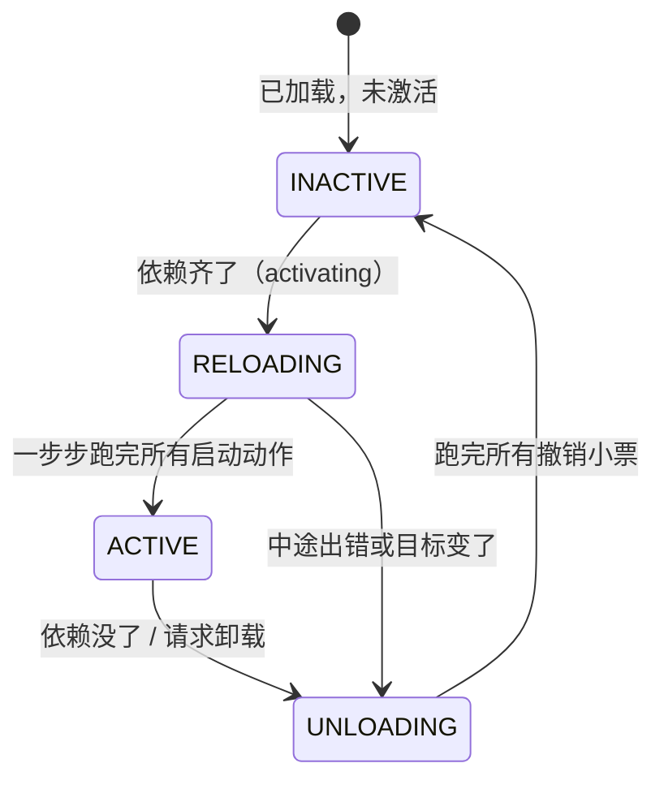

# 让插件像乐高一样装卸

## 2. 空间维：响应式 coeffect —— "厨师报菜，厨房喊开工"

### 2.1 核心思想（一个比喻）

把系统想成一间餐厅的后厨：

*   每个厨师（插件）上岗前要报菜单（coeffect specification）："我要有炉子、有食材才能开炒。"
*   厨房里有一块公共白板（coeffect context $\Sigma$）：炉子在不在、食材有没有，都写在上面。
*   系统安排一个传菜员盯着白板：
    *   厨师要的东西从缺到齐 → 喊他开工（activating）
    *   从齐到缺（炉子被搬走了）→ 喊他停工（deactivating）
    *   其他变化 → 不吭声（neutral）

插件作者只管"我需要什么"，完全不用写"等 A 加载完了我再初始化"这种胶水代码。依赖的满足与否，自动驱动插件的生死。

### 2.2 公式逐个讲

#### 第一个公式：coeffect context —— 一张"名字 → 服务"的表**

$$\Sigma := (k : K) \rightharpoonup \mathcal{V}_k$$

*   $\Sigma$（读作 Sigma）：coeffect context，就是那张白板。
*   $K$：所有"服务名"的集合，比如 `'database'`、`'logger'`、`'http'`。
*   $k$：其中某一个服务名。
*   $\rightharpoonup$：这个箭头读作"部分映射"——它是个函数，但只在一部分输入上有定义（不是每个服务名都有值）。
*   $\mathcal{V}_k$：服务名 $k$ 对应的值的类型。比如 `'database'` 对应一个数据库连接对象。

**人话：白板就是一个 Map，键是服务名，值是服务对象。但不是每个服务名都一定有值——服务可能还没被任何插件提供。换句话说，$\Sigma$ 就是一个部分 key 有对于 value 的 Map。** 

用 JS 表示就是：

```javascript
// Σ：一张部分映射表（对应论文的 Σ）
const board = new Map();
// board.get('database') 可能有值，也可能 undefined
```

#### 第二个公式：读依赖（依赖齐备性检查）

$$ \sigma \vDash d := \forall k \in d, k \in \mathrm{dom}(\sigma) $$

##### 1. 生活比喻：餐厅后厨的《设备登记表》
假设你是一个新来的厨师（**插件**），你要做一道菜，手里有一张 **《开工必备设备清单》 $d$**：
`d = ['烤箱', '打蛋器']`

厨房墙上有一块 **《当前可用设备登记表》 $\sigma$**。这张表是“键值对”形式的，不仅写了设备名字，还写了具体型号（值）：
```javascript
// 这就是 σ (当前的白板 / 完整的 Map)
const sigma = new Map([
  ['烤箱', '西门子型号X'],  
  ['搅拌机', '美的型号Y'],
  ['冰箱', '海尔双开门']
]);
```

现在，系统要检查 $\sigma \vDash d$（登记表是否满足你的清单），它会提取出登记表最左侧的 **“设备名称列”**，这就是 **$\mathrm{dom}(\sigma)$**：
```javascript
// 这就是 dom(σ) (白板上已登记的服务名集合 / Map 的 Key 集合)
const domSigma = ['烤箱', '搅拌机', '冰箱']; 
```
**系统检查员的操作步骤**：
1. **$\forall k \in d$（对于清单 $d$ 中的每一个名字 $k$）**：拿起清单上的 `'烤箱'`，再拿起 `'打蛋器'`。
2. **$k \in \mathrm{dom}(\sigma)$（这个名字 $k$，存在于登记表的“名称列”中吗？）**：
   - 问：`'烤箱'` 在 `['烤箱', '搅拌机', '冰箱']` 里吗？ 👉 **✅ 在 (True)**
   - 问：`'打蛋器'` 在 `['烤箱', '搅拌机', '冰箱']` 里吗？ 👉 **❌ 不在 (False)**
3. **结论 ($\vDash$ 满足)**：因为**不是所有**的 $k$ 都在 $\mathrm{dom}(\sigma)$ 中（打蛋器缺失），所以 $\sigma \vDash d$ 为 **False**。系统判定：厨师不能开工，继续等待 `'打蛋器'` 被登记到白板上。

##### 2. 数学符号逐字“人话”翻译

| 数学符号 | 读音/名称 | 人话翻译（对应上面的比喻） |
| :--- | :--- | :--- |
| $\sigma$ | Sigma | **当前的白板**。记录了现在系统里已经有哪些服务可用（包含具体的值）。 |
| $d$ | deps | **插件的依赖清单**。比如 `['database', 'logger']`。 |
| $\vDash$ | 满足 (models) | 一个判定动作，意思是“左边的环境，能否满足右边的需求”。 |
| $:=$ | 定义为 | 意思是“等号左边这个符号，它的具体含义就是等号右边这句话”。 |
| $\forall$ | 对于所有 (for all) | **挨个检查**。强调“清单里的**每一个**元素，都不能漏掉”。 |
| $k \in d$ | k 属于 d | 拿出清单 $d$ 里的某一个服务名，我们叫它 $k$（比如 $k$ = 'database'）。 |
| $\mathrm{dom}(\sigma)$ | sigma 的定义域 | **白板上已经登记的名字集合**。在 JS 的 `Map` 中，就是所有已经 `set` 过的 **Key 的集合**（不关心对应的 Value 是什么）。 |
| $k \in \mathrm{dom}(\sigma)$ | k 属于 dom(sigma) | 这个服务名 $k$，存在于白板的登记名单里吗？ |

**整句人话（直译）**：
“环境 $\sigma$ 满足需求 $d$” 定义为：对于需求清单 $d$ 中的**每一个**服务名 $k$，$k$ 都必须存在于白板 $\sigma$ 的已登记名字集合（$\mathrm{dom}$）中。

##### 3. JS 代码逐行对照

现在回头看这段 JS 代码，你会发现它和公式是**严丝合缝**的：

```javascript
// σ ⊨ d 的 JS 版
function satisfied(board, deps) {
  // 1. [...deps] 
  //    对应公式里的 "d" (依赖清单)。如果 deps 是个 Set，展开成数组方便遍历。
  
  // 2. .every(...) 
  //    对应公式里的 "∀" (对于所有)。
  //    every 的意思是：数组里的每一项都必须返回 true，整体才返回 true。
  
  // 3. k => board.has(k)
  //    对应公式里的 "k ∈ dom(σ)"。
  //    k 就是清单里的当前项。
  //    board.has(k) 就是在问：白板(board)的已登记名字集合(dom)里，有 k 吗？
  
  return [...deps].every(k => board.has(k)); 
}
```

##### 4. 为什么公式必须强调 $\mathrm{dom}(\sigma)$，而不是直接查 $\sigma$？

在插件系统中，区分 $\sigma$ 和 $\mathrm{dom}(\sigma)$ 有极其重要的工程意义：

- **依赖检查只看“名字”（Key），不看“实现”（Value）。**
  插件 A 声明需要 `'database'`，它只关心白板上**有没有** `'database'` 这个 Key（即 $k \in \mathrm{dom}(\sigma)$）。至于这个 `'database'` 对应的是 MySQL 还是 PostgreSQL（Value），插件 A 在依赖检查阶段根本不关心。那是它被激活后，调用 `ctx.get('database')` 时才去处理的事。
- **精准映射**：在 JS 中，`board.has(k)` 本质上就是在查询 Map 的 Domain（定义域/Key 集合），完美对应了数学上的 $k \in \mathrm{dom}(\sigma)$。

### 第三个公式：notify —— 三态通知（边缘触发与生命周期驱动）

$$ \mathrm{notify}_d(\sigma, \sigma') := \begin{cases} \text{activating} & \sigma \nvDash d \wedge \sigma' \vDash d \\ \text{deactivating} & \sigma \vDash d \wedge \sigma' \nvDash d \\ \text{neutral} & \text{其他情况} \end{cases} $$

#### 1. 生活比喻：传菜员的“盯梢”与“扣扳机”
延续我们后厨的比喻。厨师（插件）上岗前，向系统递交了一份**契约**，包含两样东西：
1. **《开工必备设备清单》**（对应代码里的 `inject: ['烤箱', '打蛋器']`）。
2. **《开工动作说明书》**（对应代码里的 `apply(ctx) { ... }`，注意：此时只是**定义**，并未执行）。

厨房里有一个传菜员（系统底层的 `notify` 机制），他手里拿着两张表：**旧白板 $\sigma$**（上一秒的设备登记表）和**新白板 $\sigma'$**（刚刚更新过的登记表）。
传菜员不关心白板上具体多了什么或少了什么，他**只关心一件事：厨师“能不能开工”的状态，有没有跨过临界线？**

- **情况一（Activating 激活 - 从缺到齐）**：
  - **旧白板 $\sigma$**：只有 `['烤箱']`。缺打蛋器，不满足（$\nvDash$）。
  - **新白板 $\sigma'$**：采购员刚把 `打蛋器` 登记上表。设备齐了，满足（$\vDash$）。
  - **传菜员动作**：状态从“不能”变成了“能” $\rightarrow$ 判定为 **`activating`**！
  - **框架扣动扳机**：系统收到信号，**亲自去调用厨师定义的 `apply(ctx)`**，厨师正式开工！

- **情况二（Deactivating 停用 - 从齐到缺）**：
  - **旧白板 $\sigma$**：有 `['烤箱', '打蛋器']`。厨师正在炒菜（满足 $\vDash$）。
  - **新白板 $\sigma'$**：烤箱突然短路被搬走维修了。缺烤箱，不满足（$\nvDash$）。
  - **传菜员动作**：状态从“能”变成了“不能” $\rightarrow$ 判定为 **`deactivating`**！
  - **框架扣动扳机**：系统立刻让插件停工，并**自动执行厨师之前交出的所有“撤销小票”**，清理案发现场。

- **情况三（Neutral 中立/无事发生 - 没跨过临界线）**：
  - **旧白板 $\sigma$**：只有 `['烤箱']`（不能开工）。
  - **新白板 $\sigma'$**：采购员买回了无关的 `['微波炉']`。依然缺打蛋器（还是不能开工）。
  - **传菜员动作**：以前不能做，现在还是不能做。状态没变 $\rightarrow$ 判定为 **`neutral`**。传菜员闭嘴，插件继续休眠，不受干扰。

#### 2. 数学符号“人话”翻译字典
公式里的分段函数 $\begin{cases} ... \end{cases}$ 其实就是编程里的 `if - else if - else`。我们逐个符号拆解：

| 数学符号 | 读音/含义 | JS 中的对应物 | 人话翻译 |
| :--- | :--- | :--- | :--- |
| $\mathrm{notify}_d(\sigma, \sigma')$ | 通知函数 | `function notify(deps, oldBoard, newBoard)` | 拿着清单 $d$，对比新旧两块白板，决定喊什么口号。 |
| $\sigma \nvDash d$ | 旧白板 **不满足** 需求 | `was === false` | 以前条件不具备（不能开工）。 |
| $\sigma' \vDash d$ | 新白板 **满足** 需求 | `is === true` | 现在条件具备了（能开工）。 |
| $\wedge$ | **并且** (逻辑与) | `&&` | 前后两个条件必须同时成立。 |
| $\text{其他情况}$ | 没发生上述两种极端翻转 | `else` | 要么一直满足，要么一直不满足。 |

**把第一行公式连起来读：**
$\sigma \nvDash d \wedge \sigma' \vDash d$ 
= "旧白板不满足" **并且** "新白板满足" 
= `was === false && is === true`（从缺到齐）

#### 3. JS 代码对照：从“纯函数”到“框架底层调用”
为了彻底解答 **“`notify` 在哪里？”** 以及 **“`apply(ctx)` 是怎么被调用的？”**，我们分两步来看代码：

**第一步：`notify` 纯函数（只负责判断状态翻转）**
```javascript
function notify(deps, oldBoard, newBoard) {
  // 调用上一个公式的 satisfied 函数
  const was = satisfied(oldBoard, deps); // 旧白板满足吗？(σ ⊨ d)
  const is  = satisfied(newBoard, deps); // 新白板满足吗？(σ' ⊨ d)
  
  if (!was && is)  return 'activating';    // 从缺到齐
  if (was && !is)  return 'deactivating';  // 从齐到缺
  return 'neutral';                        // 没变
}
```

**第二步：框架底层的“暗箱操作”（驱动生命周期）**
`notify` 本身只是个计算器，真正厉害的是**框架底层如何消费它的结果**。每次白板发生变化时，框架内部会自动运行这段逻辑：

```javascript
// 框架底层伪代码（每次白板更新时触发）
function onBoardChanged(oldBoard, newBoard, plugin) {
  // 1. 传菜员盯梢：计算三态通知
  const state = notify(plugin.inject, oldBoard, newBoard);
  
  // 2. 框架扣动扳机：根据通知结果，驱动插件生命周期
  if (state === 'activating' && !plugin.isActive) {
    plugin.isActive = true;
    // 💥 高潮：框架亲自调用你定义的 apply 函数！
    // 并传入带有“时光倒流”能力的超级上下文 ctx
    plugin.apply(superCtx); 
  } 
  else if (state === 'deactivating' && plugin.isActive) {
    plugin.isActive = false;
    // 🧹 框架自动执行清理：收回所有撤销小票，一键回滚
    superCtx.recover(); 
  }
  // neutral 情况下，框架什么都不做，插件保持原状
}
```

#### 4. 为什么这种设计极其优雅？（工程意义）

看懂了这个流程，你就会明白这篇论文最伟大的地方在于：**它把“空间维（依赖关系）”和“时间维（生命周期）”完美缝合了。**

**传统的插件开发（痛点：回调地狱）**
插件作者必须自己写一堆恶心的胶水代码去监听依赖，手动管理生死：
```javascript
// 传统写法：令人崩溃
on('serviceA_ready', () => {
  on('serviceB_ready', () => {
     startMyPlugin();
     on('serviceA_removed', () => stopMyPlugin()); // 还要手动写清理！
  })
})
```

**论文/Cordis 的插件开发（降维打击：声明式契约）**
插件作者**只负责声明（`inject`）**和**定义动作（`apply`）**。
```javascript
// 论文写法：极其清爽
const myPlugin = {
  inject: ['A', 'B'],      // 1. 递交清单 (d)
  apply(ctx) { ... }       // 2. 定义动作 (等待被调用)
}
```

**总结**：
`notify` 公式就像一个**边缘触发（Edge-triggered）** 的过滤器。它过滤掉了白板上所有无效的噪音（`neutral`），只在依赖状态发生**实质性翻转**的那一瞬间，精准地扣动扳机。
“什么时候调用 `apply`”、“依赖中途没了怎么清理”，这些极其复杂的逻辑，插件作者一行代码都不用写，全被论文里的 **$\vDash$ (满足公式)** 和 **$\mathrm{notify}$ (三态通知公式)** 在框架底层自动包揽了！


### 第四个公式（全文最妙的一处接缝）：写依赖本身也是一个可逆 effect！

$$\mathrm{set}(k, v) : \mathfrak{E}^*_\Sigma$$

#### 1. 符号拆解：每个字符在说什么？

| 数学符号 | 读音/含义 | 人话翻译 |
| :--- | :--- | :--- |
| $\mathrm{set}(k, v)$ | 写白板操作 | 往白板上写一个服务。比如 `set('database', 数据库实例)`。 |
| $\mathfrak{E}^*$ | 可逆 effect 的类型 | 就是 §1 里那个“带撤销小票的改动”的类型。做改动，必须交出撤销函数。 |
| $\Sigma$（下标） | **类型下标（泛型参数）** | 指明这个可逆 effect **作用的目标对象是“依赖白板 $\Sigma$”**，而不是其他环境状态。 |

**整句人话（直译）**：
“往白板上写服务”这件事，不是一个简单的 `map.set()` 普通赋值，而是被系统强制归类为**作用于白板 $\Sigma$ 上的“可逆 effect”**。它的正向操作是“把服务写上白板”，它的撤销小票就是“把服务从白板上擦掉”。


#### 2. 生活比喻：供应商、撤销小票与“幽灵依赖”

延续后厨的比喻。白板是墙上的《可用设备登记表》。

插件 A 不是“采购员”，而是 **“烤箱的供应商兼维护员”**。它提供的“烤箱”（服务），是它内部代码运行出来的功能实例（比如一个数据库连接、一个 API 接口）。

*   **如果插件 A 被卸载了**，它内部的代码停止运行，它提供的“烤箱”也就**失效了**（数据库连接断了、接口下线了）。
*   此时，如果白板上的“烤箱”不擦掉，其他厨师（依赖烤箱的插件 B）看着白板，以为还有烤箱，跑去调用，结果拿到的是一个**已经死掉的幽灵对象**，直接报错崩溃！这就是 **“幽灵依赖”**。

**所以，系统的铁律是：**
插件 A（供应商）启动时，把“烤箱”搬进厨房并在白板上登记。同时，系统**强制**要求他交出一张**撤销小票**（$\mathfrak{E}^*_\Sigma$）：“如果我撤柜，请把白板上的‘烤箱’擦掉”。


#### 3. 类型系统的真相：工单（Type）与记账员（Function）

为了彻底看透 $\mathfrak{E}^*_\Sigma$ 中那个下标 $\Sigma$ 的工程意义，以及它和 `track` 的关系，我们用 TypeScript 的**泛型（Generic）** 来翻译它。

在 TS 视角下，$\mathfrak{E}^*$ 就是一个泛型接口（**工单**），而下标 $\Sigma$ 和 $\Gamma$ 就是传入的**类型参数**。`track` 则是消费这张工单的**记账员**。

```typescript
// ==========================================
// 1. 定义白板 Σ 和 全局环境 Γ
// ==========================================
type Sigma = Map<string, any>;          // 依赖白板 Σ (服务名 -> 实例)

// 根据论文 §3 的统一上下文，白板 Σ 被焊死在全局环境 Γ 中
type Gamma = {
  board: Sigma;       // 白板 Σ 是 Γ 的一部分
  routes: string[];   // 其他全局状态
};

// ==========================================
// 2. 定义 Effect Context ∂Γ (环境 + 撤销链)
// ==========================================
// 这就是框架传递给插件的超级上下文 ctx 的真实类型！
type EffectContext = {
  gamma: Gamma;                     // 当前环境状态 (包含白板)
  phi: (env: Gamma) => Gamma;       // 撤销累积器 (一摞退款单)
};

// ==========================================
// 3. 定义“工单”：可逆 effect 的类型 (对应数学符号 E*)
// ==========================================
// 注意：工单操作的是完整的 Γ，因为 Σ 只是 Γ 的一个属性，
// 之前说的 (f, g) 的类型就是 ReversibleEffect。
type ReversibleEffect = {
  forward: (env: Gamma) => Gamma;   // 正向改动 (f)
  backward: (env: Gamma) => Gamma;  // 撤销小票 (g)
};

// ==========================================
// 4. 定义“记账员”：track 函数 (消费 ReversibleEffect)
// ==========================================
function track(effect: ReversibleEffect, ctx: EffectContext): EffectContext {
  return {
    // 1. 拆开工单，执行正向改动，更新环境
    gamma: effect.forward(ctx.gamma),
    // 2. 把新的小票塞进撤销链 (LIFO 后进先出)
    phi: (env) => ctx.phi(effect.backward(env))
  };
}
```

**关系揭秘**：
`ReversibleEffect` 是**填好的施工与拆除申请表（工单）**，而 `track` 是**盖章并执行这张工单的记账员**。没有工单，记账员没东西可吃；没有记账员，工单就只是一张废纸。


#### 4. 闭环第四个公式：`ctx.set` 的底层真相

现在，我们回到那个“全文最妙的接缝”。当插件作者调用 `ctx.set('database', db)` 时，框架底层到底发生了什么？
**真相是：`ctx.set` 在底层偷偷构造了一个修改 `Gamma`（内含白板 `Sigma`）的 `ReversibleEffect` 工单，然后把它喂给了 `track`！**

```typescript
// 这就是框架提供给插件作者的 API：ctx.set
function setService(k: string, v: any, ctx: EffectContext): EffectContext {
  
  // 【核心机密】：系统动态生成了一张针对全局环境 Γ 的“工单”
  // 但工单内部的逻辑，是精准去修改 Γ 中的白板 Σ
  // 这完美对应了公式：set(k, v) : E*_Σ
  const setEffect: ReversibleEffect = {
    
    // 正向操作 (f)：往白板上写
    forward: (env: Gamma) => {
      env.board.set(k, v); 
      return env;
    },
    
    // 撤销小票 (g)：从白板上擦掉
    backward: (env: Gamma) => {
      env.board.delete(k); 
      return env;
    }
  };

  // 【执行与存档】：把这张工单交给记账员 track 
  // track 会立刻执行 forward（白板上多出该服务），
  // 并把 backward 塞进 ctx 的撤销链 (phi) 中，等待插件卸载时被调用。
  return track(setEffect, ctx);
}
```

看明白了吗？在类型系统里，**“往白板上写一个服务”** 和 **“注册一个 HTTP 路由”** 是**完全平等**的。它们都是接收 $\Gamma$ 返回 $\Gamma$ 的 `ReversibleEffect`，都受 `track` 和 $\partial\Gamma$ 的严格管辖。


#### 5. 为什么这是“最妙的接缝”？（多米诺骨牌效应）

论文前半部分（§1 时间维）解决了：**插件自己产生的垃圾（路由、定时器）怎么清理？** 靠可逆 effect。
论文后半部分（§2 空间维）解决了：**插件之间的依赖怎么自动连线？** 靠白板 $\Sigma$ 和 `notify`。

**痛点来了**：白板本身也是系统环境的一部分！如果插件 A 往白板上写了 `database`，当插件 A 卸载时，白板上的 `database` 算不算“垃圾”？谁来清理它？

**接缝的魔力**：论文没有为“清理白板”发明一套新机制，而是直接**把“修改白板”降维成了 §1 里的“可逆 effect”**！

让我们看看这个接缝是如何引发**自动级联卸载**的多米诺骨牌效应的：

1.  **插件 A（数据库驱动）启动**：调用 $\mathrm{set}('database', db)$。系统收下撤销小票：`delete('database')`。
2.  **插件 B（用户 API）声明依赖 `['database']`**：传菜员（`notify`）发现白板满足了 B 的需求，触发 **`activating`**，B 开工！
3.  **高潮：插件 A 崩溃或被卸载了！**
    *   系统启动插件 A 的卸载程序，反序执行撤销小票 $\rightarrow$ **系统自动把 `database` 从白板上擦掉**！
    *   白板发生变化，传菜员（`notify`）立刻盯梢，发现插件 B 的依赖从“齐”变成了“缺”，触发 **`deactivating`**！
    *   插件 B 收到信号，自动停工，清理自己的现场。

**结论**：“提供服务的插件卸载” $\rightarrow$ “白板自动擦除” $\rightarrow$ “依赖它的插件自动停工”，一气呵成！


#### 6. 总结

$$\mathrm{set}(k, v) : \mathfrak{E}^*_\Sigma$$

这短短一行公式，用一套极其优雅的数学模型（可逆 effect），同时降维打击了 **“时间维的内存泄漏”** 和 **“空间维的幽灵依赖”** 两个世界级难题。

它把“空间维的白板管理”和“时间维的插件卸载”完美焊死在了一起，让插件提供服务和插件消费服务，用的是**同一套“改动 + 撤销”机制**。这就是为什么论文说这是“全文最妙的一处接缝”，也是实现“时空可组合”的终极基石。

### 2.3 用 JS 写一个迷你版

```javascript
/**
 * 迷你响应式 coeffect 系统 —— 论文 §3.2 的 JS 版
 * 插件只声明"我需要什么"，系统在白板变化时自动激活/停用
 */

// ── 白板：服务名 → 服务对象（对应论文的 Σ）─────────
// 注意：这是被所有插件共享的"环境"的一部分，
// 对它的每次修改都必须走可逆 effect（见下方 setService）
const board = new Map();          // σ：当前白板

// ── 插件表：所有已加载的插件 ──────────────────────
const plugins = new Map();        // name → plugin 定义

// ── 注册插件：声明依赖清单 d ──────────────────────
function definePlugin(name, deps, activate, deactivate) {
  plugins.set(name, { deps: new Set(deps), activate, deactivate, active: false });
}

// ── 核心：白板变化后，检查每个插件的满足状态 ──────
// 对应论文的 notify（Def.26）
function checkAll(oldBoard) {
  for (const [name, p] of plugins) {
    const was = [...p.deps].every(k => oldBoard.has(k)); // σ ⊨ d ?
    const is  = [...p.deps].every(k => board.has(k));    // σ' ⊨ d ?
    if (!was && is && !p.active) {
      // activating：从缺到齐 → 开工
      p.active = true;
      console.log(`[activating] ${name} 依赖齐了，开工`);
      p.activate();
    } else if (was && !is && p.active) {
      // deactivating：从齐到缺 → 停工（并撤销它的一切改动）
      p.active = false;
      console.log(`[deactivating] ${name} 依赖没了，停工`);
      p.deactivate();
    }
    // neutral：满足状态没变 → 什么都不做
  }
}

// ── 提供服务：可逆 effect（对应论文的 set(k,v)：ℰ*Σ）──
const disposers = new Map(); // 每个服务的"撤销小票"
function provideService(name, value) {
  const old = new Map(board);        // 旧白板 σ（快照）
  board.set(name, value);            // 正向：写上服务
  disposers.set(name, () => {        // 撤销小票：擦掉服务
    board.delete(name);
    checkAll(new Map(board).set(name, value)); // 用"擦掉前"的白板对比
  });
  checkAll(old);                     // 通知所有插件（用新旧白板对比）
}
function revokeService(name) {
  const undo = disposers.get(name);
  if (undo) undo();
}

// ═══ 使用示例 ═══════════════════════════════════════
definePlugin('db-driver', [], () => {
  console.log('  db-driver：连接数据库');
  provideService('database', { query: () => [] });
}, () => {
  console.log('  db-driver：断开数据库');
  revokeService('database');
});

definePlugin('user-api', ['database'], () => {
  console.log('  user-api：注册 /users 路由');
}, () => {
  console.log('  user-api：注销 /users 路由');
});

// 1. 先只加载驱动。user-api 的依赖 'database' 没人提供 → 保持休眠
console.log('--- 加载 db-driver ---');
const old1 = new Map(board);
board.set('boot', true); // 触发一次检查
plugins.get('db-driver').activate(); plugins.get('db-driver').active = true;

// 2. db-driver 提供 database 服务 → user-api 自动激活！
console.log('--- db-driver 开始提供 database ---');
provideService('database', { query: () => [] });

// 3. db-driver 被卸载、database 没了 → user-api 自动停用！
console.log('--- db-driver 被卸载 ---');
revokeService('database');

/**
 * 输出：
 * [activating] user-api 依赖齐了，开工      ← 全自动，user-api 作者什么都没写
 * [deactivating] user-api 依赖没了，停工     ← 也是全自动
 */
```

**重点体会：**`user-api` 的作者只写了"我需要 database"，从未写过一个回调去等 database。 激活和停用都是系统对着白板做差分后自动驱动的。

### 2.4 两个进阶概念（知道即可）

*   **isolation（隔离域，$\Sigma^{iso}$）**：同名的服务，在不同"房间"里可以是不同的东西。比如测试环境和生产环境各有一块白板。就像一个词"炉子"，中餐间和西餐间指的是不同的灶。实现上就是查表时多查一层：`key → 房间号 → 值`。
*   **interception（拦截，$\Sigma^{inter}$）**：不改服务本身，但给"某个插件怎么用这个服务"叠一层规则——比如给社区插件的数据库访问加只读限制。类比：经理不改菜谱，但规定"这道菜今天限量"。特点是不用改插件代码，由外层强制。

## 3. 统一上下文：把前两张表焊成一张

### 3.1 公式

$$\Gamma_\infty := \mu\Gamma. \Gamma \times (\Gamma \to \Gamma) \times \Sigma$$

这是全文看着最吓人的一个公式，拆开就三样：

*   $:=$ 定义；
*   $\Sigma$：刚讲的依赖白板；
*   $\times$：配对（前面说过，就是二元组）；
*   $\Gamma \times (\Gamma \to \Gamma)$：§1 的"环境 + 撤销累积器"；
*   $\mu\Gamma.$：读作"最小的、满足右边等式的 $\Gamma$"——数学上处理"自己定义自己"（递归类型）的标准记号。就是 JS 里的递归：

```javascript
// μΓ 的白话版：一个对象，它里面装着"它自己 + 一个改它自己的函数 + 白板"
// 【修正】JavaScript 中需要先创建对象，再赋值 self 属性，避免循环引用报错
const ctx = {};
ctx.self = ctx;        // ← Γ 递归地指向自己
ctx.undo = () => {};   // ← (Γ→Γ)：撤销累积器
ctx.board = new Map(); // ← Σ：依赖白板
```

**人话总结：**全系统只有一个统一对象 `ctx`，它同时装着〔当前状态〕、〔一摞撤销小票〕、〔依赖白板〕。 插件的所有交互都经过这一个对象，所以每次交互都能被追踪、被归因到具体插件。真实框架 Cordis 里的 `ctx` 就是这个 $\Gamma_\infty$ 的实现。

### 3.2 观察等价（observational equivalence）—— "查不出区别就算一样"

§1 说"撤销后环境要精确还原"，但现实中做不到字面意义的还原（内存布局变了）。论文的解法是放宽"相等"的定义：

**两个状态，只要没有任何使用者能查出区别，就算相等。**记作 $\simeq$（读作"波浪等于"）。

比喻：两本厚薄、排版都不同的字典，只要查任何一个词释义都一样，读者就无从分辨、可以当它们相等。

这个定义为什么关键？因为由此可以证明两条结构性定理：

*   **Thm.40**：动不同服务名的两个操作，天然独立（各写各的键，互不干扰）。
*   **Thm.42**：就算动同一个键，只要这个键上的操作可交换（比如"注册路由"——注册 `/a` 和注册 `/b` 谁先来结果一样），两个插件也独立。

而"独立"意味着什么？回到 §1.4：**独立的插件可以并发、可以任意顺序装卸。** 于是：

**用"空间维"的信息（插件动的键是否不同），解锁"时间维"的性质（卸载顺序随便排）。** ——这就是论文标题"时空可组合"（Spatiotemporal Composability）的由来。

一个反例帮你理解"不可交换"：两个插件都往同一条中间件链的头部插函数，谁先谁后结果完全不同——这种键就不可交换，顺序必须由别处强制。所以"哪些插件能随便并发"不是拍脑袋，而是可以对着服务键逐条检查出来的。

---

## 4. 组件生命周期：一台不会出错的状态机

前面都是"一个插件"的视角。这一节把许多插件放在一起，给每个运行中的插件实例（论文叫 fiber）配一台状态机。

### 4.1 白话版状态机



**四个状态的白话：**

| 状态 | 白话 |
| :--- | :--- |
| INACTIVE | 插件在内存里躺着，啥也没干 |
| RELOADING | 正在激活：逐步执行它的启动动作，每步的撤销小票同步累积 |
| ACTIVE | 正常工作，撤销小票摞好了，随时可以撤 |
| UNLOADING | 正在停用：执行撤销小票（后注册的先撤） |

**四个设计要点，每个都对应一个真实痛点：**

1.  **激活是"一步步"的，不是原子的**（对应论文 §4.3.2 Iteration）。启动动作可能有很多步，每步之间是个天然的检查点——中途发现"目标变了"（比如依赖突然没了），可以立刻掉头去卸载，已做的部分按小票回滚。
2.  **卸载拆成两步：先"停止提供服务"，再"动手清理"**（§4.3.1 Withdrawal）。为什么？因为插件 B 的收尾代码可能还需要用它依赖的服务（比如归还数据库连接）。如果 A 一被卸载就立刻断掉 `database`，B 的收尾就崩了。所以状态机保证：B 完全走完之后，A 才允许真正清理。 这个"等依赖者先走完"的守卫，论文叫 withdrawal guard。
3.  **正在进行的迁移必须跑完，不能半途切换**（§4.3.3 Asynchrony/"惯性"）。异步操作发起后，环境可能已经变了，但这条进行中的操作必须落地，然后再响应新目标——否则状态会错乱。就像已经端上桌的菜不能收回去重做，先上菜、再处理厨房的新指令。
4.  **失败了也要干净落地**（§4.3.4 Failure）。启动到一半出错（端口被占、文件不存在），不能留个烂摊子：已做的全部撤销，插件进入"失败态"并记录错误，不影响其他插件，也不无脑重试。

### 4.2 五条定理的白话版

论文给这套状态机证明了五条性质，每条翻成人话：

| 定理 | 人话 |
| :--- | :--- |
| **Preservation（Thm.59）** | 系统永远停在 "结构良好 "的状态里，不会某步之后进入莫名其妙的状态 |
| **Recovery exactness + Terminal recovery（Thm.61 + Cor.62）** | 插件退出后，它对世界的影响 **归零** ——环境回到它加载之前（在 "查不出区别 "的意义下） |
| **Ordering（Thm.63）** | 依赖者永远后激活、先停用；停用期间它依赖的服务全程可读 |
| **Progress（Thm.66）** | 只要依赖关系 **不成环** ，系统一定向前推进、最终安静下来（不会死锁）；守卫（等依赖者）一定会释放 |
| **Confluence（Thm.73）** | **最值钱的一条** ：无论插件装卸的顺序、并发如何，只要最终配置相同，系统安静下来后的状态就是同一个 |

**Confluence 意味着一件工程上极其爽的事：你可以把动态系统当静态系统推理。** 不用关心"先装 A 再装 B"和"先装 B 再装 A"有什么区别——没区别。系统最终长什么样，只取决于"最后装了哪些插件、什么配置"，不取决于历史。

前提要说清楚（论文很诚实）：Recovery 和 Confluence 要求插件们的改动两两独立，Progress 要求依赖不成环（A 依赖 B、B 又依赖 A 的话，两个会永远卡在 INACTIVE，好在加载时就能静态报出来）。

---

## 5. 落地：Cordis 框架和 Koishi

理论有了，代码在哪？**Cordis**（开源，TypeScript）就是这套理论的几乎逐行实现：

| 论文概念 | Cordis 代码 |
| :--- | :--- |
| $\Gamma_\infty$ 统一上下文 | `ctx` 对象 |
| 可逆 effect | `ctx.effect(callback)` —— 回调里 yield 出撤销函数 |
| 依赖白板 $\Sigma$ | `ctx.get(key)` / `ctx.set(key, value)` |
| 声明依赖 $d$ | 组件定义里的 `inject: ['database']` |
| fiber 状态机 | 每个插件实例的状态：`INACTIVE` / `LOADING` / `ACTIVE` / `UNLOADING` / `FAILED` |
| 拦截 / 隔离 | `ctx.intercept()` / `ctx.isolate()` |

实际用起来是这样的（简化示意）：

```typescript
// 定义一个组件：声明"我需要 logger"，提供"我的服务"
const myPlugin = {
  inject: ['logger'],                    // ← 依赖声明（论文的 d）
  apply(ctx) {                           // ← 激活时执行（论文的 effect iterator）
    ctx.effect(() => {                   // 每个改动包在可逆 effect 里
      const timer = setInterval(tick, 1000);
      return () => clearInterval(timer); // ← 撤销小票：卸载时自动执行
    });
    ctx.set('myservice', { ping() {} }); // 提供服务（自动可逆：卸载即移除）
  },
};

const fiber = ctx.use(myPlugin);  // 实例化 → 走状态机
// fiber.dispose() → 一键卸载：定时器关了、服务移除了，干干净净
```

**热更新（HMR）是这套理论白送的福利：**改代码保存后，旧插件实例 `dispose`（自动撤销一切）→ 用新代码实例化重装。对比 Webpack/Vite 的 HMR 需要开发者手写 `module.hot.accept(...)` 标注"哪些改动在哪里接住"，Cordis 不需要——因为每个插件的边界和撤销路径已经是系统强制的了。

**Koishi**（一个 4000+ 插件的开源聊天机器人框架）是生产验证：它的 web 控制台本身就是一个独立的 Cordis 应用。论文诚实声明：这是"存在性 + 被采用"的证据，不是和替代方案的受控对比实验。

---

## 6. 这套理论的边界（论文自己承认的坑）

*   **撤销函数对不对，运行时不管。**系统强制你"交撤销小票"，但小票内容对不对（真的撤干净了吗）是插件作者的责任。它是"结构性保证的前提是每个原子逆元正确"。
*   **跨边界的操作不算数。**已经发出的网络请求、已经发出去的邮件——这些没法撤销，只能"先扣着不发"（withhold）或"事后补偿"（compensation，比如再发一封"上封作废"）。
*   **内存里的状态默认活不过热更新。**卸载重装 = 回到干净状态重新来，旧实例的局部变量没了。想保留状态，得主动放进长寿的共享服务里。这一点对"AI agent 自我改写"这个头号动机其实是个待解的硬伤。
*   **依赖只按名字匹配，没有版本和类型检查。**`ctx.get('foo')` 拿到的 `foo` 是 1.0 还是 2.0 接口、兼不兼容，框架不管（目前靠 npm 的 peerDependencies 约定兜底）。
*   **循环依赖无解：**A 等 B、B 等 A，双双永远休眠（好在能在加载时静态检测并报错）。

---

## 7. 一页纸总结

*   **问题：**运行中装卸插件，传统做法只有重启；插件作者手写清理代码不可靠（VSCode 前 100 扩展中 87 个一装就卸不掉、只有 7 个声明了依赖）。
*   **时间维答案（可逆 effect）：**每个改动必须配套交出撤销函数，系统按"后进先出"累积，卸载 = 一键反序执行。这是 §1 那 40 行 JS 的事。
*   **空间维答案（响应式 coeffect）：**插件声明"我需要什么"，系统盯着服务白板，满足性从缺到齐就激活、从齐到缺就停用。全程自动，不用写胶水代码。
*   **统一：**两者装进同一个对象 `ctx`；靠"观察等价"证明"动不同键的插件天然独立"，于是空间维的信息解锁时间维的自由——这就是"时空可组合"。
*   **系统级：**一套四状态生命周期状态机 + 五条定理，保证"插件退出的影响归零、并发装卸结果唯一、不成环必不死锁"。
*   **落地：**Cordis（TypeScript）≈ 理论的逐行翻译；Koishi 4000+ 插件作生产验证；论文§8 把"AI agent 自改写 harness"列为下一步——因为它要的正是"改错了能干净撤回"。

如果想继续深入，建议顺序：亲手把 §1.3 和 §2.3 的两段 JS 跑一遍 → 读 Cordis 源码的 `ctx.effect` → 再回头看论文的 §3.1（可逆 effect 的代数性质）。公式到那时就只是"你写的 JS 的严格版"了。