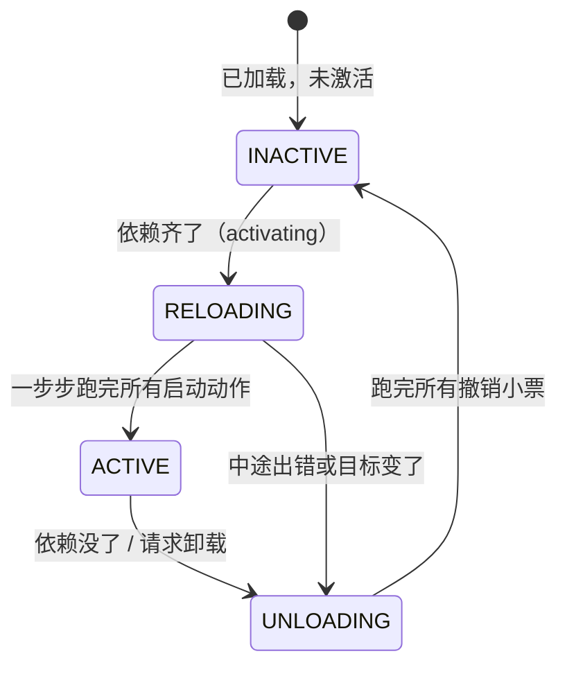

# 让插件像乐高一样装卸

## 3. 统一上下文：把时间维、空间维和自我引用定义成一个对象（$\Gamma_\infty$）

第三章不是要把“时间上下文”和“依赖白板”临时拼成两个对象。

第 1 章定义了时间维：当前环境 $\Gamma$ 和撤销链 $\Gamma \to \Gamma$。  
第 2 章定义了空间维：依赖白板 $\Sigma$，并且已经把白板放进了环境里：

```ts
type Gamma = {
  board: Sigma;
  routes: string[];
  timers: Set<any>;
};
```

所以，从第 2 章开始，`EffectContext` 已经同时承载了时间维和空间维。

第 3 章要做的事情是：

> 把这个已经包含当前状态、撤销能力、依赖白板的上下文，正式定义成系统里唯一的统一上下文 $\Gamma_\infty$，并且给它加上“自我引用”的能力。

这就是第 3 章的核心公式：

$$
\Gamma_\infty := \mu\Gamma.\; \Gamma \times (\Gamma \to \Gamma) \times \Sigma
$$

可以先粗暴地读成一句话：

> $\Gamma_\infty$ 是一个统一上下文。它里面有当前环境 $\Gamma$，有撤销函数 $\Gamma \to \Gamma$，有依赖白板 $\Sigma$，并且这个上下文还能引用自身。

### 3.1 公式逐项翻译

$$
\Gamma_\infty := \mu\Gamma.\; \Gamma \times (\Gamma \to \Gamma) \times \Sigma
$$

逐个符号拆开：

- $\Gamma_\infty$：统一上下文，也就是插件最终拿到的那个总 `ctx`。
- $:=$：定义为。可以理解为 TypeScript 里的 `type` 或 `interface`。
- $\mu\Gamma$：递归类型($\mu\Gamma$ 声明一个叫 Γ 的递归类型变量，点后的 Γ × (Γ → Γ) × Σ，就是这个变量的类型结构)，在这里表示这个上下文可以引用自身。 
- $\Gamma$：当前系统环境。
- $\Gamma \to \Gamma$：撤销累积器，也就是“撤销函数链”。
- $\Sigma$：依赖白板，记录服务名到服务实例的映射。
- $\times$：把几部分打包进同一个对象。

对应到 TypeScript 里，就是：

```ts
interface UnifiedContext {
  self: UnifiedContext;      // μΓ：自我引用
  gamma: Gamma;              // Γ：当前环境
  phi: (env: Gamma) => Gamma; // Γ → Γ：撤销累积器
}
```

其中，依赖白板 $\Sigma$ 在工程实现里通常被放进 `gamma.board`：

```ts
type Gamma = {
  board: Sigma;
  routes: string[];
  timers: Set<ReturnType<typeof setInterval>>;
};
```

这样做的原因很重要：

> 只有把白板放进环境 $\Gamma$ 里，“往白板上写服务”才会成为一种可撤销的副作用。

这正是第 2 章那个最关键的接缝：

$$
\mathrm{set}(k, v) : \mathfrak{E}^*_\Sigma
$$

翻译成代码就是：

```ts
ctx.set('database', db);
```

本质上也是一个 `ReversibleEffect`。

### 3.2 $\mu\Gamma$ 是什么？

公式里最抽象的是：

$$
\mu\Gamma
$$

它叫“最小不动点”，在这里可以理解为：**递归类型**。

先不要想得太数学。工程上它表达的是：

> 这个上下文对象内部有一个稳定入口，能够找到它自己。

在 TypeScript 里，就是：

```ts
interface UnifiedContext {
  self: UnifiedContext;
}
```

注意：这不是让对象无限套娃。

运行时它其实只是一个有限对象，加一个指向自己的引用：

```ts
ctx.self = ctx;
```

它解决的是真实插件系统里一个很常见的问题：

> `ctx` 可能被传递到很深的调用栈里，也可能被框架包装成代理对象、隔离对象、受限对象。此时如果靠 `this`，很容易丢失；但如果保留了 `self`，插件仍然可以找到真正的统一上下文。

例如：

```ts
const wrappedCtx = {
  ...ctx,
  extra: true,
};

wrappedCtx.self === ctx; // true
```

无论外面包了多少层，`self` 都可以作为稳定导航。

### 3.3 用 TypeScript 翻译整个公式

下面这段代码，就是 $\Gamma_\infty$ 的一个清晰工程版本。

```ts
// Σ：依赖白板
type Sigma = Map<string, unknown>;

// Γ：当前系统环境
type Gamma = {
  board: Sigma;
  routes: string[];
  timers: Set<ReturnType<typeof setInterval>>;
};

// 可逆副作用：正向改动 + 撤销小票
type ReversibleEffect = {
  forward: (env: Gamma) => Gamma;
  backward: (env: Gamma) => Gamma;
};

// Γ∞：统一上下文
interface UnifiedContext {
  // μΓ：自我引用
  self: UnifiedContext;

  // Γ：当前环境
  gamma: Gamma;

  // Γ → Γ：撤销累积器
  phi: (env: Gamma) => Gamma;

  // 记录一个可逆副作用
  track: (effect: ReversibleEffect) => UnifiedContext;

  // 一键回滚
  recover: () => UnifiedContext;

  // 往白板上写服务
  set: (key: string, value: unknown) => UnifiedContext;

  // 从白板上读服务
  get: (key: string) => unknown;
}
```

这段代码和公式的对应关系非常直接：

```ts
self        // μΓ：自我引用
gamma       // Γ：当前环境
phi         // Γ → Γ：撤销链
gamma.board // Σ：依赖白板
```

### 3.4 创建统一上下文：完成 `self` 的自我指认

下面是一个简化但完整的运行时实现。

为了方便展示统一上下文的稳定入口，这里采用“根上下文可变”的写法。如果实现成不可变派生上下文，原理也相同，只是状态更新方式不同。

```ts
function createUnifiedContext(): UnifiedContext {
  const ctx: UnifiedContext = {
    self: null as unknown as UnifiedContext,

    // 当前环境 Γ
    gamma: {
      board: new Map(),
      routes: [],
      timers: new Set(),
    },

    // 撤销累积器初始值：什么都不做
    phi: env => env,

    // track：(γ, φ) ↦ (f(γ), φ ∘ g)
    track(effect: ReversibleEffect) {
      const prevPhi = ctx.phi;

      // 执行正向改动
      ctx.gamma = effect.forward(ctx.gamma);

      // 把新的撤销小票塞进旧撤销链里面
      ctx.phi = env => prevPhi(effect.backward(env));

      return ctx.self;
    },

    // recover：(γ, φ) ↦ (φ(γ), id)
    recover() {
      // 执行整条撤销链
      ctx.gamma = ctx.phi(ctx.gamma);

      // 清空撤销链，恢复为恒等函数
      ctx.phi = env => env;

      return ctx.self;
    },

    // set(k, v) 本质上是一个可逆副作用
    set(key: string, value: unknown) {
      return ctx.track({
        forward: env => ({
          ...env,
          board: new Map(env.board).set(key, value),
        }),

        backward: env => {
          const board = new Map(env.board);
          board.delete(key);
          return { ...env, board };
        },
      });
    },

    get(key: string) {
      return ctx.gamma.board.get(key);
    },
  };

  // μΓ 的运行时体现：自己指向自己
  ctx.self = ctx;

  return ctx;
}
```

这里最关键的一行是：

```ts
ctx.self = ctx;
```

这就是 $\mu\Gamma$ 在运行时的落地方式。

它让上下文完成“自我指认”：

> 我就是统一上下文，并且我身上带着找到我自己的入口。

### 3.5 `track` 和 `recover` 如何对应公式？

第 1 章的 `track` 公式是：

$$
\mathrm{track}_\Gamma(f, g) = (\gamma, \varphi) \mapsto (f(\gamma), \varphi \circ g)
$$

对应代码：

```ts
track(effect: ReversibleEffect) {
  const prevPhi = ctx.phi;

  ctx.gamma = effect.forward(ctx.gamma);

  ctx.phi = env => prevPhi(effect.backward(env));

  return ctx.self;
}
```

这里：

```ts
effect.forward(ctx.gamma)
```

对应：

$$
f(\gamma)
$$

也就是执行正向改动。

这里：

```ts
env => prevPhi(effect.backward(env))
```

对应：

$$
\varphi \circ g
$$

也就是把新的撤销小票塞进旧的撤销链里。

当未来执行 `recover` 时，JavaScript 会从内向外调用函数，因此新的撤销操作会先执行，旧的撤销操作后执行，天然形成后进先出。

`recover` 的公式是：

$$
\mathrm{recover}_\Gamma = (\gamma, \varphi) \mapsto (\varphi(\gamma), \mathrm{id})
$$

对应代码：

```ts
recover() {
  ctx.gamma = ctx.phi(ctx.gamma);
  ctx.phi = env => env;
  return ctx.self;
}
```

这里：

```ts
ctx.phi(ctx.gamma)
```

对应：

$$
\varphi(\gamma)
$$

也就是把当前环境喂给整条撤销链，让它一层层恢复。

这里：

```ts
ctx.phi = env => env
```

对应：

$$
\mathrm{id}
$$

也就是把撤销链重置为“什么都不做”。

### 3.6 为什么公式里还要单独写 $\Sigma$？

你可能会问：既然代码里已经把 `Sigma` 放进 `Gamma.board` 了，为什么公式还要写成：

$$
\Gamma \times (\Gamma \to \Gamma) \times \Sigma
$$

而不是直接写成：

$$
\Gamma \times (\Gamma \to \Gamma)
$$

原因是：论文要强调依赖白板不是普通业务数据，而是统一上下文的一等公民。

在工程上，我们把 $\Sigma$ 放进 $\Gamma$，是为了让它能被 `track` 和 `recover` 管理。

但在概念上，$\Sigma$ 必须被单独强调，因为它承载的是空间维：

- 插件声明依赖；
- 插件提供服务；
- 系统检查依赖是否满足；
- 依赖变化时自动激活或停用插件。

所以公式里的 $\Sigma$ 是在告诉我们：

> 统一上下文不仅要有时间维的撤销能力，还必须显式包含空间维的依赖白板。

而代码里把 `board` 放进 `gamma`，是为了让这个空间维对象也进入时间维的撤销系统。

这就是两章内容真正焊死的地方。

### 3.7 一个简短例子

```ts
const ctx = createUnifiedContext();

// 插件 A 提供服务
ctx.set('database', { query: () => ['user'] });

// 插件 A 注册路由
ctx.track({
  forward: env => ({
    ...env,
    routes: [...env.routes, '/api'],
  }),
  backward: env => ({
    ...env,
    routes: env.routes.filter(r => r !== '/api'),
  }),
});

console.log(ctx.gamma.board.has('database')); // true
console.log(ctx.gamma.routes);                // ['/api']

// 卸载插件：一键回滚
ctx.recover();

console.log(ctx.gamma.board.has('database')); // false
console.log(ctx.gamma.routes);                // []
```

这个例子里：

- `set('database', ...)` 修改了白板 $\Sigma$；
- `track(...)` 注册了路由 $\Gamma$；
- 两者都被记入撤销链 $\Gamma \to \Gamma$；
- `recover()` 一次性把它们都撤销掉。

这就是统一上下文的意义。

### 3.8 为什么必须把它们焊成一个对象？

$\Gamma_\infty$ 要解决的不是“把几个字段放一起”这么简单，而是让插件系统获得四个能力。

#### 3.8.1 单一事实来源

所有状态都放在 `ctx.gamma` 里：

```ts
ctx.gamma
```

系统只认这一份环境。

插件不能各自偷偷维护全局状态，否则卸载时无法保证清理干净。

#### 3.8.2 强制可撤销

插件每次调用 `track` 或 `set`，都必须交出撤销逻辑。

```ts
forward;
backward;
```

卸载插件不再依赖作者自觉，而是由系统机制强制保证。

#### 3.8.3 白板改动也可撤销

因为白板在 `gamma.board` 里，所以：

```ts
ctx.set('database', db);
```

不是普通赋值，而是一个可逆副作用。

插件卸载时，服务会自动从白板上消失。

这就避免了“幽灵依赖”。

#### 3.8.4 上下文永不迷失

通过：

```ts
ctx.self
```

插件在复杂调用链、代理包装、隔离上下文中，仍然可以找到统一上下文。

这就是 $\mu\Gamma$ 的工程价值。

### 3.9 一句话总结

$$
\Gamma_\infty := \mu\Gamma.\; \Gamma \times (\Gamma \to \Gamma) \times \Sigma
$$

这个公式定义的是整个插件系统唯一的统一上下文：

```ts
{
  self,        // μΓ：自我引用
  gamma,       // Γ：当前环境
  phi,         // Γ → Γ：撤销链
  gamma.board  // Σ：依赖白板
}
```

它把时间维的撤销能力、空间维的依赖白板，以及上下文的自我引用能力，全部焊进同一个对象里。

从此以后，插件的所有行为都必须经过这个 `ctx`：  
**改动会被记录，服务会被登记，卸载会被回滚，依赖会被自动感知。**

---

## 4. 组件生命周期：一台不会出错的状态机

前面都是"一个插件"的视角。这一节把许多插件放在一起，给每个运行中的插件实例（论文叫 fiber）配一台状态机。

### 4.1 白话版状态机



**四个状态的白话：**

| 状态 | 白话 |
| :--- | :--- |
| INACTIVE | 插件在内存里躺着，啥也没干 |
| RELOADING | 正在激活：逐步执行它的启动动作，每步的撤销小票同步累积 |
| ACTIVE | 正常工作，撤销小票摞好了，随时可以撤 |
| UNLOADING | 正在停用：执行撤销小票（后注册的先撤） |

**四个设计要点，每个都对应一个真实痛点：**

1.  **激活是"一步步"的，不是原子的**（对应论文 §4.3.2 Iteration）。启动动作可能有很多步，每步之间是个天然的检查点——中途发现"目标变了"（比如依赖突然没了），可以立刻掉头去卸载，已做的部分按小票回滚。
2.  **卸载拆成两步：先"停止提供服务"，再"动手清理"**（§4.3.1 Withdrawal）。为什么？因为插件 B 的收尾代码可能还需要用它依赖的服务（比如归还数据库连接）。如果 A 一被卸载就立刻断掉 `database`，B 的收尾就崩了。所以状态机保证：B 完全走完之后，A 才允许真正清理。 这个"等依赖者先走完"的守卫，论文叫 withdrawal guard。
3.  **正在进行的迁移必须跑完，不能半途切换**（§4.3.3 Asynchrony/"惯性"）。异步操作发起后，环境可能已经变了，但这条进行中的操作必须落地，然后再响应新目标——否则状态会错乱。就像已经端上桌的菜不能收回去重做，先上菜、再处理厨房的新指令。
4.  **失败了也要干净落地**（§4.3.4 Failure）。启动到一半出错（端口被占、文件不存在），不能留个烂摊子：已做的全部撤销，插件进入"失败态"并记录错误，不影响其他插件，也不无脑重试。

### 4.2 五条定理的白话版

论文给这套状态机证明了五条性质，每条翻成人话：

| 定理 | 人话 |
| :--- | :--- |
| **Preservation（Thm.59）** | 系统永远停在 "结构良好 "的状态里，不会某步之后进入莫名其妙的状态 |
| **Recovery exactness + Terminal recovery（Thm.61 + Cor.62）** | 插件退出后，它对世界的影响 **归零** ——环境回到它加载之前（在 "查不出区别 "的意义下） |
| **Ordering（Thm.63）** | 依赖者永远后激活、先停用；停用期间它依赖的服务全程可读 |
| **Progress（Thm.66）** | 只要依赖关系 **不成环** ，系统一定向前推进、最终安静下来（不会死锁）；守卫（等依赖者）一定会释放 |
| **Confluence（Thm.73）** | **最值钱的一条** ：无论插件装卸的顺序、并发如何，只要最终配置相同，系统安静下来后的状态就是同一个 |

**Confluence 意味着一件工程上极其爽的事：你可以把动态系统当静态系统推理。** 不用关心"先装 A 再装 B"和"先装 B 再装 A"有什么区别——没区别。系统最终长什么样，只取决于"最后装了哪些插件、什么配置"，不取决于历史。

前提要说清楚（论文很诚实）：Recovery 和 Confluence 要求插件们的改动两两独立，Progress 要求依赖不成环（A 依赖 B、B 又依赖 A 的话，两个会永远卡在 INACTIVE，好在加载时就能静态报出来）。

---

## 5. 落地：Cordis 框架和 Koishi

理论有了，代码在哪？**Cordis**（开源，TypeScript）就是这套理论的几乎逐行实现：

| 论文概念 | Cordis 代码 |
| :--- | :--- |
| $\Gamma_\infty$ 统一上下文 | `ctx` 对象 |
| 可逆 effect | `ctx.effect(callback)` —— 回调里 yield 出撤销函数 |
| 依赖白板 $\Sigma$ | `ctx.get(key)` / `ctx.set(key, value)` |
| 声明依赖 $d$ | 组件定义里的 `inject: ['database']` |
| fiber 状态机 | 每个插件实例的状态：`INACTIVE` / `LOADING` / `ACTIVE` / `UNLOADING` / `FAILED` |
| 拦截 / 隔离 | `ctx.intercept()` / `ctx.isolate()` |

实际用起来是这样的（简化示意）：

```typescript
// 定义一个组件：声明"我需要 logger"，提供"我的服务"
const myPlugin = {
  inject: ['logger'],                    // ← 依赖声明（论文的 d）
  apply(ctx) {                           // ← 激活时执行（论文的 effect iterator）
    ctx.effect(() => {                   // 每个改动包在可逆 effect 里
      const timer = setInterval(tick, 1000);
      return () => clearInterval(timer); // ← 撤销小票：卸载时自动执行
    });
    ctx.set('myservice', { ping() {} }); // 提供服务（自动可逆：卸载即移除）
  },
};

const fiber = ctx.use(myPlugin);  // 实例化 → 走状态机
// fiber.dispose() → 一键卸载：定时器关了、服务移除了，干干净净
```

**热更新（HMR）是这套理论白送的福利：**改代码保存后，旧插件实例 `dispose`（自动撤销一切）→ 用新代码实例化重装。对比 Webpack/Vite 的 HMR 需要开发者手写 `module.hot.accept(...)` 标注"哪些改动在哪里接住"，Cordis 不需要——因为每个插件的边界和撤销路径已经是系统强制的了。

**Koishi**（一个 4000+ 插件的开源聊天机器人框架）是生产验证：它的 web 控制台本身就是一个独立的 Cordis 应用。论文诚实声明：这是"存在性 + 被采用"的证据，不是和替代方案的受控对比实验。

---

## 6. 这套理论的边界（论文自己承认的坑）

*   **撤销函数对不对，运行时不管。**系统强制你"交撤销小票"，但小票内容对不对（真的撤干净了吗）是插件作者的责任。它是"结构性保证的前提是每个原子逆元正确"。
*   **跨边界的操作不算数。**已经发出的网络请求、已经发出去的邮件——这些没法撤销，只能"先扣着不发"（withhold）或"事后补偿"（compensation，比如再发一封"上封作废"）。
*   **内存里的状态默认活不过热更新。**卸载重装 = 回到干净状态重新来，旧实例的局部变量没了。想保留状态，得主动放进长寿的共享服务里。这一点对"AI agent 自我改写"这个头号动机其实是个待解的硬伤。
*   **依赖只按名字匹配，没有版本和类型检查。**`ctx.get('foo')` 拿到的 `foo` 是 1.0 还是 2.0 接口、兼不兼容，框架不管（目前靠 npm 的 peerDependencies 约定兜底）。
*   **循环依赖无解：**A 等 B、B 等 A，双双永远休眠（好在能在加载时静态检测并报错）。

---

## 7. 一页纸总结

*   **问题：**运行中装卸插件，传统做法只有重启；插件作者手写清理代码不可靠（VSCode 前 100 扩展中 87 个一装就卸不掉、只有 7 个声明了依赖）。
*   **时间维答案（可逆 effect）：**每个改动必须配套交出撤销函数，系统按"后进先出"累积，卸载 = 一键反序执行。这是 §1 那 40 行 JS 的事。
*   **空间维答案（响应式 coeffect）：**插件声明"我需要什么"，系统盯着服务白板，满足性从缺到齐就激活、从齐到缺就停用。全程自动，不用写胶水代码。
*   **统一：**两者装进同一个对象 `ctx`；靠"观察等价"证明"动不同键的插件天然独立"，于是空间维的信息解锁时间维的自由——这就是"时空可组合"。
*   **系统级：**一套四状态生命周期状态机 + 五条定理，保证"插件退出的影响归零、并发装卸结果唯一、不成环必不死锁"。
*   **落地：**Cordis（TypeScript）≈ 理论的逐行翻译；Koishi 4000+ 插件作生产验证；论文§8 把"AI agent 自改写 harness"列为下一步——因为它要的正是"改错了能干净撤回"。

如果想继续深入，建议顺序：亲手把 §1.3 和 §2.3 的两段 JS 跑一遍 → 读 Cordis 源码的 `ctx.effect` → 再回头看论文的 §3.1（可逆 effect 的代数性质）。公式到那时就只是"你写的 JS 的严格版"了。