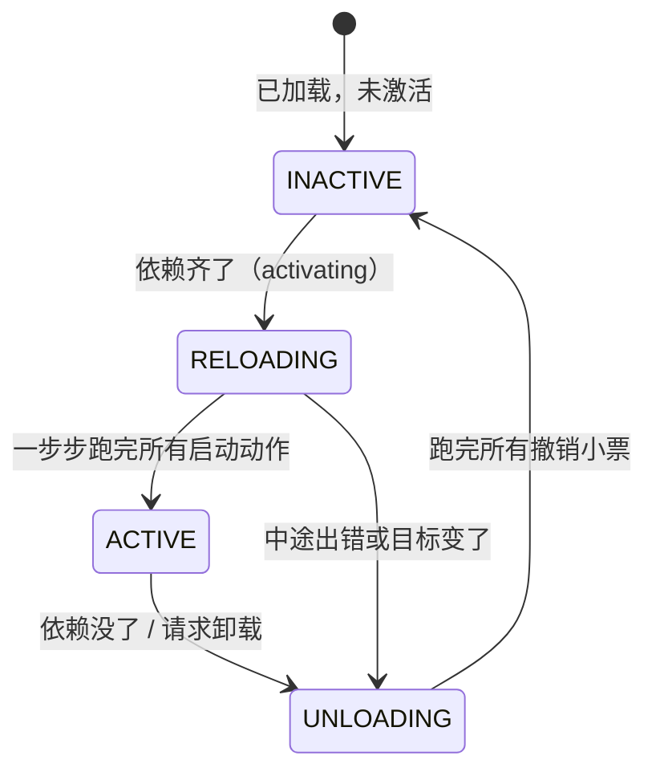

## 3. 统一上下文：把前两张表焊成一张

### 3.1 公式

$$\Gamma_\infty := \mu\Gamma. \Gamma \times (\Gamma \to \Gamma) \times \Sigma$$

这是全文看着最吓人的一个公式，拆开就三样：

*   $:=$ 定义；
*   $\Sigma$：刚讲的依赖白板；
*   $\times$：配对（前面说过，就是二元组）；
*   $\Gamma \times (\Gamma \to \Gamma)$：§1 的"环境 + 撤销累积器"；
*   $\mu\Gamma.$：读作"最小的、满足右边等式的 $\Gamma$"——数学上处理"自己定义自己"（递归类型）的标准记号。就是 JS 里的递归：

```javascript
// μΓ 的白话版：一个对象，它里面装着"它自己 + 一个改它自己的函数 + 白板"
// 【修正】JavaScript 中需要先创建对象，再赋值 self 属性，避免循环引用报错
const ctx = {};
ctx.self = ctx;        // ← Γ 递归地指向自己
ctx.undo = () => {};   // ← (Γ→Γ)：撤销累积器
ctx.board = new Map(); // ← Σ：依赖白板
```

**人话总结：**全系统只有一个统一对象 `ctx`，它同时装着〔当前状态〕、〔一摞撤销小票〕、〔依赖白板〕。 插件的所有交互都经过这一个对象，所以每次交互都能被追踪、被归因到具体插件。真实框架 Cordis 里的 `ctx` 就是这个 $\Gamma_\infty$ 的实现。

### 3.2 观察等价（observational equivalence）—— "查不出区别就算一样"

§1 说"撤销后环境要精确还原"，但现实中做不到字面意义的还原（内存布局变了）。论文的解法是放宽"相等"的定义：

**两个状态，只要没有任何使用者能查出区别，就算相等。**记作 $\simeq$（读作"波浪等于"）。

比喻：两本厚薄、排版都不同的字典，只要查任何一个词释义都一样，读者就无从分辨、可以当它们相等。

这个定义为什么关键？因为由此可以证明两条结构性定理：

*   **Thm.40**：动不同服务名的两个操作，天然独立（各写各的键，互不干扰）。
*   **Thm.42**：就算动同一个键，只要这个键上的操作可交换（比如"注册路由"——注册 `/a` 和注册 `/b` 谁先来结果一样），两个插件也独立。

而"独立"意味着什么？回到 §1.4：**独立的插件可以并发、可以任意顺序装卸。** 于是：

**用"空间维"的信息（插件动的键是否不同），解锁"时间维"的性质（卸载顺序随便排）。** ——这就是论文标题"时空可组合"（Spatiotemporal Composability）的由来。

一个反例帮你理解"不可交换"：两个插件都往同一条中间件链的头部插函数，谁先谁后结果完全不同——这种键就不可交换，顺序必须由别处强制。所以"哪些插件能随便并发"不是拍脑袋，而是可以对着服务键逐条检查出来的。

---

## 4. 组件生命周期：一台不会出错的状态机

前面都是"一个插件"的视角。这一节把许多插件放在一起，给每个运行中的插件实例（论文叫 fiber）配一台状态机。

### 4.1 白话版状态机



**四个状态的白话：**

| 状态 | 白话 |
| :--- | :--- |
| INACTIVE | 插件在内存里躺着，啥也没干 |
| RELOADING | 正在激活：逐步执行它的启动动作，每步的撤销小票同步累积 |
| ACTIVE | 正常工作，撤销小票摞好了，随时可以撤 |
| UNLOADING | 正在停用：执行撤销小票（后注册的先撤） |

**四个设计要点，每个都对应一个真实痛点：**

1.  **激活是"一步步"的，不是原子的**（对应论文 §4.3.2 Iteration）。启动动作可能有很多步，每步之间是个天然的检查点——中途发现"目标变了"（比如依赖突然没了），可以立刻掉头去卸载，已做的部分按小票回滚。
2.  **卸载拆成两步：先"停止提供服务"，再"动手清理"**（§4.3.1 Withdrawal）。为什么？因为插件 B 的收尾代码可能还需要用它依赖的服务（比如归还数据库连接）。如果 A 一被卸载就立刻断掉 `database`，B 的收尾就崩了。所以状态机保证：B 完全走完之后，A 才允许真正清理。 这个"等依赖者先走完"的守卫，论文叫 withdrawal guard。
3.  **正在进行的迁移必须跑完，不能半途切换**（§4.3.3 Asynchrony/"惯性"）。异步操作发起后，环境可能已经变了，但这条进行中的操作必须落地，然后再响应新目标——否则状态会错乱。就像已经端上桌的菜不能收回去重做，先上菜、再处理厨房的新指令。
4.  **失败了也要干净落地**（§4.3.4 Failure）。启动到一半出错（端口被占、文件不存在），不能留个烂摊子：已做的全部撤销，插件进入"失败态"并记录错误，不影响其他插件，也不无脑重试。

### 4.2 五条定理的白话版

论文给这套状态机证明了五条性质，每条翻成人话：

| 定理 | 人话 |
| :--- | :--- |
| **Preservation（Thm.59）** | 系统永远停在 "结构良好 "的状态里，不会某步之后进入莫名其妙的状态 |
| **Recovery exactness + Terminal recovery（Thm.61 + Cor.62）** | 插件退出后，它对世界的影响 **归零** ——环境回到它加载之前（在 "查不出区别 "的意义下） |
| **Ordering（Thm.63）** | 依赖者永远后激活、先停用；停用期间它依赖的服务全程可读 |
| **Progress（Thm.66）** | 只要依赖关系 **不成环** ，系统一定向前推进、最终安静下来（不会死锁）；守卫（等依赖者）一定会释放 |
| **Confluence（Thm.73）** | **最值钱的一条** ：无论插件装卸的顺序、并发如何，只要最终配置相同，系统安静下来后的状态就是同一个 |

**Confluence 意味着一件工程上极其爽的事：你可以把动态系统当静态系统推理。** 不用关心"先装 A 再装 B"和"先装 B 再装 A"有什么区别——没区别。系统最终长什么样，只取决于"最后装了哪些插件、什么配置"，不取决于历史。

前提要说清楚（论文很诚实）：Recovery 和 Confluence 要求插件们的改动两两独立，Progress 要求依赖不成环（A 依赖 B、B 又依赖 A 的话，两个会永远卡在 INACTIVE，好在加载时就能静态报出来）。

---

## 5. 落地：Cordis 框架和 Koishi

理论有了，代码在哪？**Cordis**（开源，TypeScript）就是这套理论的几乎逐行实现：

| 论文概念 | Cordis 代码 |
| :--- | :--- |
| $\Gamma_\infty$ 统一上下文 | `ctx` 对象 |
| 可逆 effect | `ctx.effect(callback)` —— 回调里 yield 出撤销函数 |
| 依赖白板 $\Sigma$ | `ctx.get(key)` / `ctx.set(key, value)` |
| 声明依赖 $d$ | 组件定义里的 `inject: ['database']` |
| fiber 状态机 | 每个插件实例的状态：`INACTIVE` / `LOADING` / `ACTIVE` / `UNLOADING` / `FAILED` |
| 拦截 / 隔离 | `ctx.intercept()` / `ctx.isolate()` |

实际用起来是这样的（简化示意）：

```typescript
// 定义一个组件：声明"我需要 logger"，提供"我的服务"
const myPlugin = {
  inject: ['logger'],                    // ← 依赖声明（论文的 d）
  apply(ctx) {                           // ← 激活时执行（论文的 effect iterator）
    ctx.effect(() => {                   // 每个改动包在可逆 effect 里
      const timer = setInterval(tick, 1000);
      return () => clearInterval(timer); // ← 撤销小票：卸载时自动执行
    });
    ctx.set('myservice', { ping() {} }); // 提供服务（自动可逆：卸载即移除）
  },
};

const fiber = ctx.use(myPlugin);  // 实例化 → 走状态机
// fiber.dispose() → 一键卸载：定时器关了、服务移除了，干干净净
```

**热更新（HMR）是这套理论白送的福利：**改代码保存后，旧插件实例 `dispose`（自动撤销一切）→ 用新代码实例化重装。对比 Webpack/Vite 的 HMR 需要开发者手写 `module.hot.accept(...)` 标注"哪些改动在哪里接住"，Cordis 不需要——因为每个插件的边界和撤销路径已经是系统强制的了。

**Koishi**（一个 4000+ 插件的开源聊天机器人框架）是生产验证：它的 web 控制台本身就是一个独立的 Cordis 应用。论文诚实声明：这是"存在性 + 被采用"的证据，不是和替代方案的受控对比实验。

---

## 6. 这套理论的边界（论文自己承认的坑）

*   **撤销函数对不对，运行时不管。**系统强制你"交撤销小票"，但小票内容对不对（真的撤干净了吗）是插件作者的责任。它是"结构性保证的前提是每个原子逆元正确"。
*   **跨边界的操作不算数。**已经发出的网络请求、已经发出去的邮件——这些没法撤销，只能"先扣着不发"（withhold）或"事后补偿"（compensation，比如再发一封"上封作废"）。
*   **内存里的状态默认活不过热更新。**卸载重装 = 回到干净状态重新来，旧实例的局部变量没了。想保留状态，得主动放进长寿的共享服务里。这一点对"AI agent 自我改写"这个头号动机其实是个待解的硬伤。
*   **依赖只按名字匹配，没有版本和类型检查。**`ctx.get('foo')` 拿到的 `foo` 是 1.0 还是 2.0 接口、兼不兼容，框架不管（目前靠 npm 的 peerDependencies 约定兜底）。
*   **循环依赖无解：**A 等 B、B 等 A，双双永远休眠（好在能在加载时静态检测并报错）。

---

## 7. 一页纸总结

*   **问题：**运行中装卸插件，传统做法只有重启；插件作者手写清理代码不可靠（VSCode 前 100 扩展中 87 个一装就卸不掉、只有 7 个声明了依赖）。
*   **时间维答案（可逆 effect）：**每个改动必须配套交出撤销函数，系统按"后进先出"累积，卸载 = 一键反序执行。这是 §1 那 40 行 JS 的事。
*   **空间维答案（响应式 coeffect）：**插件声明"我需要什么"，系统盯着服务白板，满足性从缺到齐就激活、从齐到缺就停用。全程自动，不用写胶水代码。
*   **统一：**两者装进同一个对象 `ctx`；靠"观察等价"证明"动不同键的插件天然独立"，于是空间维的信息解锁时间维的自由——这就是"时空可组合"。
*   **系统级：**一套四状态生命周期状态机 + 五条定理，保证"插件退出的影响归零、并发装卸结果唯一、不成环必不死锁"。
*   **落地：**Cordis（TypeScript）≈ 理论的逐行翻译；Koishi 4000+ 插件作生产验证；论文§8 把"AI agent 自改写 harness"列为下一步——因为它要的正是"改错了能干净撤回"。

如果想继续深入，建议顺序：亲手把 §1.3 和 §2.3 的两段 JS 跑一遍 → 读 Cordis 源码的 `ctx.effect` → 再回头看论文的 §3.1（可逆 effect 的代数性质）。公式到那时就只是"你写的 JS 的严格版"了。