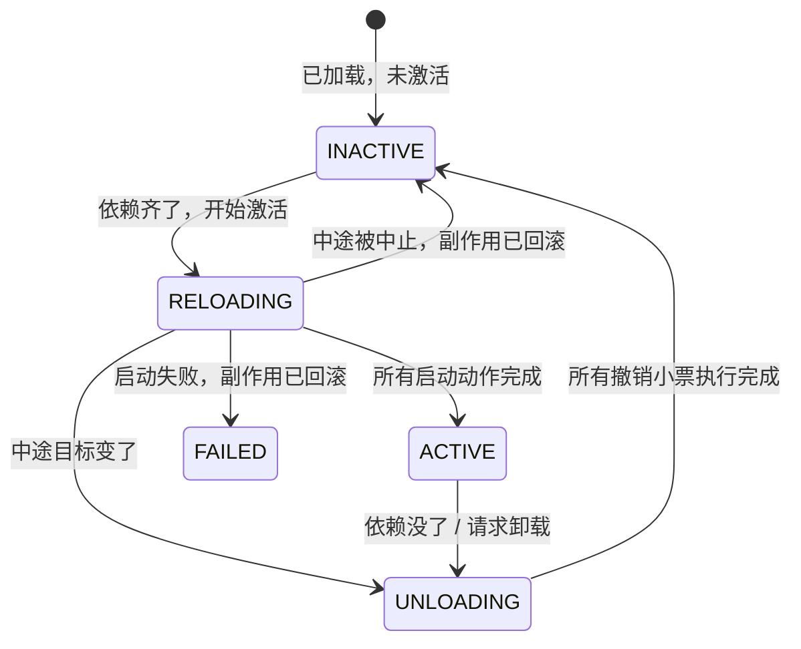

# 让插件像乐高一样装卸


## 4. 组件生命周期：一台不会出错的状态机

前面讲的是“一个插件”如何做到可撤销。  
但从第 4 节开始，问题变成了：

> 系统里同时有很多插件。  
> 有些插件提供服务，有些插件依赖服务。  
> 有些插件正在激活，有些插件正在卸载。  
> 如何保证它们在并发、失败、依赖变化时仍然不乱？

答案是为每个运行中的插件实例，也就是论文里的 **fiber**，配备一台状态机。

但状态机不能只是画一张图。真正要回答的是：

1. 插件的状态存放在哪里？
2. 状态迁移由谁触发？
3. 激活到一半依赖没了怎么办？
4. 卸载时依赖它的插件怎么办？
5. 异步操作正在跑，能不能中途切换？
6. 启动失败了怎么保证不留垃圾？
7. 多个插件同时装卸，为什么最终状态还能稳定？

下面用 TypeScript 把这些事情落地。

---

### 4.1 先复用前文的统一上下文类型

第 3 节已经定义了统一上下文 `UnifiedContext`。这里继续复用它们：

```ts
// Σ：依赖白板
type Sigma = Map<string, unknown>;

// Γ：当前系统环境
type Gamma = {
  board: Sigma;
  routes: string[];
  timers: Set<ReturnType<typeof setInterval>>;
};

// 可逆副作用：正向改动 + 撤销小票
type ReversibleEffect = {
  forward: (env: Gamma) => Gamma;
  backward: (env: Gamma) => Gamma;
};

// Γ∞：统一上下文
interface UnifiedContext {
  self: UnifiedContext;

  // Γ：当前环境
  gamma: Gamma;

  // Γ → Γ：撤销累积器
  phi: (env: Gamma) => Gamma;

  // 记录一个可逆副作用
  track: (effect: ReversibleEffect) => UnifiedContext;

  // 一键回滚
  recover: () => UnifiedContext;

  // 往白板上写服务
  set: (key: string, value: unknown) => UnifiedContext;

  // 从白板上读服务
  get: (key: string) => unknown;
}
```

但是进入多插件系统后，会出现一个新问题：

> 如果所有插件共用同一个 `ctx.phi`，那么卸载插件 A 时，不能把整个系统的撤销链都回滚掉，否则插件 B、C、D 的改动也会被误伤。

所以工程上需要做一个非常关键的拆分：

- **环境 `Gamma` 是全局共享的**：这是系统唯一事实来源。
- **撤销链 `phi` 是插件实例私有的**：每个插件只回滚自己的副作用。

也就是说，第 3 节的统一上下文仍然成立，但在多插件运行时里，它会变成：

```ts
共享：gamma.board、gamma.routes、gamma.timers
私有：每个 fiber 自己的 phi
```

这正是状态机能工作的基础。

---

### 4.2 插件实例状态：INACTIVE、RELOADING、ACTIVE、UNLOADING、FAILED

每个插件实例，也就是 fiber，有五个状态：

```ts
type FiberState =
  | 'INACTIVE'
  | 'RELOADING'
  | 'ACTIVE'
  | 'UNLOADING'
  | 'FAILED';
```

对应白话：

| 状态 | 含义 |
| :--- | :--- |
| `INACTIVE` | 插件已加载，但没有激活 |
| `RELOADING` | 正在激活，启动动作逐步执行，撤销小票逐步累积 |
| `ACTIVE` | 插件正常工作，副作用已登记，可随时卸载 |
| `UNLOADING` | 正在停用，正在按撤销小票回滚 |
| `FAILED` | 启动失败，但失败现场已经清理 |

插件本身可以定义成：

```ts
interface PluginDef {
  name: string;

  // 依赖声明，对应论文里的 d
  inject?: string[];

  // 激活逻辑
  apply: (ctx: UnifiedContext) => void | Promise<void>;
}
```

每个运行中的插件实例：

```ts
interface Fiber {
  id: string;
  plugin: PluginDef;
  state: FiberState;

  // 该插件自己的统一上下文
  // 撤销链 phi 是私有的；环境 gamma（包含白板 Σ）是全局共享的。
  ctx: UnifiedContext;

  // 目标状态：
  // 如果用户请求卸载，则 target = 'INACTIVE'
  // 如果系统希望它激活，则 target = 'ACTIVE'
  target: 'ACTIVE' | 'INACTIVE';

  // 失败信息
  error?: unknown;

  // 当前激活过程
  activation?: Promise<void>;

  // 当前卸载过程
  unloading?: Promise<void>;
}
```

这里有两个关键字段：

#### `state`

表示“这个插件现在实际处于什么阶段”。

#### `target`

表示“系统希望它最终去哪里”。

这两个字段分开非常重要。  
因为异步系统里经常出现这种情况：

> 用户已经要求卸载，但当前激活步骤还没跑完。  
> 此时不能瞬间跳过去，只能等当前步骤落地，再转向卸载。

这就是论文里说的“惯性”。

---

### 4.3 给每个 fiber 一个自己的上下文，但共享同一个环境

为了让多个插件共享同一个事实来源，我们让调度器持有全局 `env`：

```ts
interface SchedulerLike {
  env: Gamma;

  // 声明某个服务由某个 fiber 提供
  claimService: (fiberId: string, key: string) => void;

  // 释放某个服务
  releaseService: (fiberId: string, key: string) => void;

  // 每次 effect 提交后，由调度器判断是否应该中止激活
  onEffectCommitted: (fiberId: string) => void;
}
```

然后给每个插件实例创建一个自己的上下文：

```ts
class FiberContext implements UnifiedContext {
  self: UnifiedContext = this;

  // 每个 fiber 自己的撤销链
  phi: (env: Gamma) => Gamma = env => env;

  constructor(
    private scheduler: SchedulerLike,
    private fiberId: string
  ) {}

  // 所有插件共享同一个当前环境 Γ
  get gamma(): Gamma {
    return this.scheduler.env;
  }

  set gamma(next: Gamma) {
    this.scheduler.env = next;
  }

  track(effect: ReversibleEffect): UnifiedContext {
    const prevPhi = this.phi;

    // 执行正向改动
    this.gamma = effect.forward(this.gamma);

    // 把新的撤销小票塞进旧撤销链里面
    this.phi = env => prevPhi(effect.backward(env));

    // 每一步副作用提交后，都检查是否应该中止激活
    this.scheduler.onEffectCommitted(this.fiberId);

    return this.self;
  }

  recover(): UnifiedContext {
    // 执行整条撤销链
    this.gamma = this.phi(this.gamma);

    // 清空撤销链，恢复为恒等函数
    this.phi = env => env;

    return this.self;
  }

  set(key: string, value: unknown): UnifiedContext {
    return this.track({
      forward: env => {
        // 登记服务归属
        this.scheduler.claimService(this.fiberId, key);

        const board = new Map(env.board);
        board.set(key, value);

        return {
          ...env,
          board,
        };
      },

      backward: env => {
        const board = new Map(env.board);
        board.delete(key);

        // 释放服务归属
        this.scheduler.releaseService(this.fiberId, key);

        return {
          ...env,
          board,
        };
      },
    });
  }

  get(key: string): unknown {
    return this.gamma.board.get(key);
  }
}
```

这段代码有几个关键点。

---

#### 第一：`gamma` 是共享的

```ts
get gamma(): Gamma {
  return this.scheduler.env;
}

set gamma(next: Gamma) {
  this.scheduler.env = next;
}
```

这意味着：

- 插件 A 注册的路由，插件 B 能看到。
- 插件 A 提供的服务，插件 B 能读到。
- 插件 A 注册的定时器，也记录在同一个环境里。

这就是“单一事实来源”。

---

#### 第二：`phi` 是私有的

```ts
phi: (env: Gamma) => Gamma = env => env;
```

每个 `FiberContext` 都有自己的 `phi`。

所以：

```ts
fiberA.ctx.recover();
```

只会回滚插件 A 自己登记的副作用，不会误伤插件 B。

---

#### 第三：`set(key, value)` 仍然是一个可逆副作用

```ts
ctx.set('database', db);
```

本质上仍然是：

```ts
ctx.track({
  forward: env => 写入服务,
  backward: env => 删除服务,
});
```

所以插件卸载时，服务会自动从白板上消失。  
这就是第 2 章和第 3 章焊死的地方。

---

### 4.4 调度器：状态机真正跑起来的地方

现在实现一个调度器 `Scheduler`。  
它负责：

- 管理所有插件实例；
- 维护依赖白板；
- 判断依赖是否满足；
- 驱动插件激活；
- 驱动插件卸载；
- 处理失败；
- 处理依赖者先退出的守卫。

```ts
class Scheduler implements SchedulerLike {
  // 全局共享环境 Γ
  env: Gamma = {
    board: new Map(),
    routes: [],
    timers: new Set(),
  };

  // 所有插件实例
  private fibers = new Map<string, Fiber>();

  // 服务归属：
  // 某个服务名是由哪个插件提供的
  // {key = service_name, value = plugin_id}
  private serviceOwners = new Map<string, string>(); 

  // 正在撤退中的服务：
  // 这些服务仍然可读，但不再用于激活新插件
  private withdrawing = new Set<string>();

  async use(plugin: PluginDef): Promise<Fiber> {
    const id = plugin.name;

    if (this.fibers.has(id)) {
      throw new Error(`Duplicate plugin: ${id}`);
    }

    const fiber: Fiber = {
      id,
      plugin,
      state: 'INACTIVE',
      target: 'ACTIVE',
      ctx: null as unknown as UnifiedContext,
    };

    fiber.ctx = new FiberContext(this, id);

    this.fibers.set(id, fiber);

    // 如果依赖已经满足，就尝试激活
    await this.activateIfReady(fiber);

    return fiber;
  }

  getFiber(id: string): Fiber | undefined {
    return this.fibers.get(id);
  }

  snapshot() {
    return {
      routes: [...this.env.routes],
      services: [...this.env.board.keys()],
      timers: this.env.timers.size,
    };
  }

  // ------------------------------------------------
  // 服务归属管理
  // ------------------------------------------------

  claimService(fiberId: string, key: string): void {
    const owner = this.serviceOwners.get(key);

    if (owner && owner !== fiberId) {
      throw new Error(
        `Service "${key}" is already provided by "${owner}".`
      );
    }

    this.serviceOwners.set(key, fiberId);
  }

  releaseService(fiberId: string, key: string): void {
    if (this.serviceOwners.get(key) === fiberId) {
      this.serviceOwners.delete(key);
    }
  }

  // ------------------------------------------------
  // 激活过程中的检查点
  // ------------------------------------------------

  onEffectCommitted(fiberId: string): void {
    const fiber = this.fibers.get(fiberId);
    if (!fiber) return;

    // 如果目标已经变成卸载，或者依赖不再满足，
    // 就中止当前激活过程。
    if (fiber.target === 'INACTIVE' || !this.depsSatisfied(fiber.plugin)) {
      throw new ActivationAborted(
        `Activation aborted for plugin "${fiberId}".`
      );
    }
  }

  // ------------------------------------------------
  // 依赖判断
  // ------------------------------------------------

  private depsSatisfied(plugin: PluginDef): boolean {
    const inject = plugin.inject ?? [];
    return inject.every(key => this.isSatisfied(key));
  }

  private isSatisfied(key: string): boolean {
    // 白板上没有这个服务，不满足
    if (!this.env.board.has(key)) {
      return false;
    }

    // 服务正在撤退，不再用于新激活
    if (this.withdrawing.has(key)) {
      return false;
    }

    // 找不到服务提供者，不满足
    const ownerId = this.serviceOwners.get(key);
    if (!ownerId) {
      return false;
    }

    const owner = this.fibers.get(ownerId);

    // 提供者必须已经 ACTIVE
    return owner?.state === 'ACTIVE';
  }

  // ------------------------------------------------
  // 激活逻辑
  // ------------------------------------------------

  private async activateIfReady(fiber: Fiber): Promise<void> {
    if (
      fiber.state === 'INACTIVE' &&
      fiber.target === 'ACTIVE' &&
      this.depsSatisfied(fiber.plugin)
    ) {
      await this.activate(fiber);
    }
  }

  private async activate(fiber: Fiber): Promise<void> {
    if (fiber.state !== 'INACTIVE') return;
    if (!this.depsSatisfied(fiber.plugin)) return;

    fiber.state = 'RELOADING';

    fiber.activation = (async () => {
      try {
        // 执行插件启动逻辑
        await fiber.plugin.apply(fiber.ctx);

        // apply 结束后，再检查一次目标是否仍然有效
        this.onEffectCommitted(fiber.id);

        fiber.state = 'ACTIVE';

        // 当前插件激活后，可能满足了其他插件的依赖，
        // 所以尝试激活所有就绪插件。
        await this.activateReadyFibers();
      } catch (error) {
        // 失败或中止：
        // 已经登记的副作用全部回滚
        fiber.ctx.recover();

        if (error instanceof ActivationAborted) {
          fiber.state = 'INACTIVE';
        } else {
          fiber.state = 'FAILED';
          fiber.error = error;
        }
      } finally {
        fiber.activation = undefined;
      }
    })();

    await fiber.activation;
  }

  private async activateReadyFibers(): Promise<void> {
    const ready = [...this.fibers.values()].filter(
      fiber =>
        fiber.state === 'INACTIVE' &&
        fiber.target === 'ACTIVE' &&
        this.depsSatisfied(fiber.plugin)
    );

    for (const fiber of ready) {
      await this.activate(fiber);
    }
  }

  // ------------------------------------------------
  // 卸载逻辑
  // ------------------------------------------------

  async unload(
    id: string,
    opts: { reason?: 'manual' | 'dependency' } = {}
  ): Promise<void> {
    const reason = opts.reason ?? 'manual';
    const fiber = this.fibers.get(id);
    if (!fiber) return;

    // 手动卸载表示用户明确希望它停止
    if (reason === 'manual') {
      fiber.target = 'INACTIVE';
    }

    // 如果插件正在激活，先让当前激活过程跑到一个检查点或结束。
    // 这对应论文里的“惯性”。
    if (fiber.state === 'RELOADING' && fiber.activation) {
      await fiber.activation.catch(() => {});
    }

    // 如果已经在卸载，直接等待卸载完成
    if (fiber.state === 'UNLOADING' && fiber.unloading) {
      await fiber.unloading;
      return;
    }

    // 只有 ACTIVE 状态才需要正式卸载
    if (fiber.state !== 'ACTIVE') {
      return;
    }

    fiber.state = 'UNLOADING';

    fiber.unloading = (async () => {
      // 1. 找出该插件提供的服务
      const providedKeys = this.providedBy(fiber.id);

      // 2. 先把这些服务标记为 withdrawing。
      // 注意：此时服务仍然可读，只是不再用于激活新插件。
      providedKeys.forEach(key => {
        this.withdrawing.add(key);
      });

      // 3. 找到依赖这些服务的插件，先让它们退出。
      const dependents = this.dependentsToUnload(providedKeys, fiber.id);

      for (const dependent of dependents) {
        await this.unload(dependent.id, { reason: 'dependency' });
      }

      // 4. 依赖者全部退出后，才真正回滚当前插件。
      // 这里会执行该插件自己的所有撤销小票。
      fiber.ctx.recover();

      // 5. 清理服务撤退标记
      providedKeys.forEach(key => {
        this.withdrawing.delete(key);
        this.serviceOwners.delete(key);
      });

      fiber.state = 'INACTIVE';
    })();

    try {
      await fiber.unloading;
    } finally {
      fiber.unloading = undefined;
    }
  }

  // ------------------------------------------------
  // 辅助查询
  // ------------------------------------------------

  private providedBy(fiberId: string): string[] {
    return [...this.serviceOwners.entries()]
      .filter(([, owner]) => owner === fiberId)
      .map(([key]) => key);
  }

  private dependentsToUnload(keys: string[], providerId: string): Fiber[] {
    const keySet = new Set(keys);

    return [...this.fibers.values()].filter(fiber => {
      if (fiber.id === providerId) return false;

      const inject = fiber.plugin.inject ?? [];
      const dependsOnProvider = inject.some(key => keySet.has(key));

      const needUnload: FiberState[] = [
        'ACTIVE',
        'RELOADING',
        'UNLOADING',
      ];

      return dependsOnProvider && needUnload.includes(fiber.state);
    });
  }
}
```

为了让“激活中止”可以被显式表达，再定义一个错误类型：

```ts
class ActivationAborted extends Error {}
```

---

### 4.5 四个状态机设计要点如何落到代码里？

现在回头看论文里的四个设计要点，会发现它们并不是抽象原则，而是上面代码里的具体机制。

---

#### 4.5.1 激活是一步步的，不是原子的

论文 §4.3.2 说激活是迭代式的。

在这份实现里，插件每调用一次：

```ts
ctx.track(...)
```

或者：

```ts
ctx.set(...)
```

都会经过：

```ts
this.scheduler.onEffectCommitted(this.fiberId);
```

也就是说，每一步副作用提交后，调度器都会检查：

```ts
if (fiber.target === 'INACTIVE' || !this.depsSatisfied(fiber.plugin)) {
  throw new ActivationAborted(...);
}
```

这意味着：

- 如果用户请求卸载，激活可以在下一步停下。
- 如果依赖突然消失，激活可以在下一步停下。
- 已经做过的部分不会烂在那里，因为 `catch` 里会执行：

```ts
fiber.ctx.recover();
```

这就是“一步步激活”的工程含义。

---

#### 4.5.2 卸载拆成两步：先停止提供服务，再真正清理

论文 §4.3.1 的 withdrawal guard，在代码里体现为：

```ts
providedKeys.forEach(key => {
  this.withdrawing.add(key);
});

const dependents = this.dependentsToUnload(providedKeys, fiber.id);

for (const dependent of dependents) {
  await this.unload(dependent.id, { reason: 'dependency' });
}

fiber.ctx.recover();
```

顺序非常关键。

假设插件 A 提供 `database`，插件 B 依赖 `database`。

如果直接卸载 A：

```ts
A.ctx.recover();
```

那么 `database` 会立刻从白板消失。

此时 B 的清理代码如果还需要 `database`，比如：

```ts
// B 的撤销逻辑里可能需要归还数据库连接
ctx.get('database');
```

就会失败。

所以状态机必须保证：

1. A 先标记自己的服务进入 `withdrawing`。
2. 依赖 A 的 B 先卸载。
3. B 卸载期间，`database` 仍然可读。
4. B 完全退出后，A 才真正执行 `recover()`。
5. `database` 才从白板消失。

这就是：

> 依赖者先退出，提供者后清理。

---

#### 4.5.3 正在进行的迁移必须跑完，不能半途切换

论文 §4.3.3 的“惯性”，在代码里体现为：

```ts
if (fiber.state === 'RELOADING' && fiber.activation) {
  await fiber.activation.catch(() => {});
}
```

如果插件正在激活：

```ts
state === 'RELOADING'
```

此时用户调用：

```ts
scheduler.unload('some-plugin');
```

调度器不会强行把状态瞬间改成 `UNLOADING`。

它会先等待当前激活过程跑完，或者跑到下一个检查点。

这对应一个很直白的工程原则：

> 已经发起的状态迁移，必须干净落地，然后才能转向新的目标。

就像已经端上桌的菜，不能中途抢回来重做。  
先让当前动作落地，再处理新的指令。

---

#### 4.5.4 失败了也要干净落地

论文 §4.3.4 要求失败不能留下烂摊子。

在代码里，激活失败会进入：

```ts
catch (error) {
  fiber.ctx.recover();

  if (error instanceof ActivationAborted) {
    fiber.state = 'INACTIVE';
  } else {
    fiber.state = 'FAILED';
    fiber.error = error;
  }
}
```

这里最关键的是：

```ts
fiber.ctx.recover();
```

也就是说：

- 如果插件已经注册了路由，撤销。
- 如果插件已经设置了服务，撤销。
- 如果插件已经注册了定时器，撤销。
- 如果插件已经修改了环境，撤销。

失败不是简单抛异常，而是：

> 已经造成的影响，必须归零。

---

### 4.6 一个完整例子：数据库插件和用户插件

下面用两个插件演示。

第一个插件提供 `database` 服务。

```ts
type Database = {
  query: (sql: string) => string[];
};

const databasePlugin: PluginDef = {
  name: 'database',

  apply(ctx) {
    // 提供服务
    ctx.set('database', {
      query: (sql: string) => [`result:${sql}`],
    });

    // 注册一条健康检查路由
    ctx.track({
      forward: env => ({
        ...env,
        routes: [...env.routes, '/_db/health'],
      }),

      backward: env => ({
        ...env,
        routes: env.routes.filter(r => r !== '/_db/health'),
      }),
    });
  },
};
```

第二个插件依赖 `database`。

```ts
const userPlugin: PluginDef = {
  name: 'user',

  inject: ['database'],

  apply(ctx) {
    const db = ctx.get('database') as Database;

    // 激活时可以读依赖
    console.log('[user] activate with database:', db.query('SELECT 1'));

    // 注册路由
    ctx.track({
      forward: env => ({
        ...env,
        routes: [...env.routes, '/users'],
      }),

      backward: env => {
        // 卸载时仍然可以尝试读取依赖。
        // 如果 withdrawal guard 正确，此时 database 还应该在。
        const database = env.board.get('database') as Database | undefined;

        if (database) {
          console.log(
            '[user] cleanup while database still readable:',
            database.query('DELETE FROM session')
          );
        }

        return {
          ...env,
          routes: env.routes.filter(r => r !== '/users'),
        };
      },
    });

    // 注册定时器
    let timer: ReturnType<typeof setInterval> | undefined;

    ctx.track({
      forward: env => {
        timer = setInterval(() => {
          // tick
        }, 1000);

        const timers = new Set(env.timers);
        timers.add(timer);

        return {
          ...env,
          timers,
        };
      },

      backward: env => {
        if (timer) {
          clearInterval(timer);
        }

        const timers = new Set(env.timers);
        if (timer) {
          timers.delete(timer);
        }

        return {
          ...env,
          timers,
        };
      },
    });
  },
};
```

然后运行：

```ts
async function main() {
  const scheduler = new Scheduler();

  // 先装数据库插件
  await scheduler.use(databasePlugin);

  console.log(scheduler.snapshot());
  // {
  //   routes: ['/_db/health'],
  //   services: ['database'],
  //   timers: 0
  // }

  // 再装用户插件
  await scheduler.use(userPlugin);

  console.log(scheduler.snapshot());
  // {
  //   routes: ['/_db/health', '/users'],
  //   services: ['database'],
  //   timers: 1
  // }

  console.log(scheduler.getFiber('database')?.state); // ACTIVE
  console.log(scheduler.getFiber('user')?.state);     // ACTIVE

  // 卸载 database
  await scheduler.unload('database');

  console.log(scheduler.snapshot());
  // {
  //   routes: [],
  //   services: [],
  //   timers: 0
  // }

  console.log(scheduler.getFiber('database')?.state); // INACTIVE
  console.log(scheduler.getFiber('user')?.state);     // INACTIVE
}

main().catch(console.error);
```

这个例子展示了几个关键行为。

---

#### 第一：依赖满足后，插件自动激活

`userPlugin` 声明：

```ts
inject: ['database']
```

如果 `database` 不存在，它会停在：

```ts
INACTIVE
```

当 `databasePlugin` 变成 `ACTIVE` 后，调度器会调用：

```ts
await this.activateReadyFibers();
```

于是 `userPlugin` 自动进入激活流程。

这就是空间维的响应式能力。

---

#### 第二：卸载提供者时，依赖者会先退出

当执行：

```ts
await scheduler.unload('database');
```

实际顺序不是：

```ts
database.recover();
user.recover();
```

而是：

```ts
database 标记 withdrawing
user 先 unload
user.recover()
database.recover()
```

所以 `userPlugin` 的 `backward` 里面仍然可以读到 `database`。

---

#### 第三：卸载后，环境影响归零

最终：

```ts
scheduler.snapshot()
```

应该回到干净状态：

```ts
{
  routes: [],
  services: [],
  timers: 0
}
```

这就是论文里的：

> 插件退出后，它对世界的影响归零。

---

### 4.7 状态机图示

结合上面的实现，状态机可以画成：



但真正重要的不是这张图本身，而是每次迁移背后都有代码保证。

---

### 4.8 五条定理在这份实现里的对应

论文给这套状态机证明了五条性质。  
这里把它们翻译成这份 TypeScript 实现里的具体机制。

---

#### 4.8.1 Preservation：系统永远停在结构良好的状态里

对应实现：

```ts
state: FiberState
```

所有状态迁移都只发生在调度器内部：

```ts
fiber.state = 'RELOADING';
fiber.state = 'ACTIVE';
fiber.state = 'UNLOADING';
fiber.state = 'INACTIVE';
fiber.state = 'FAILED';
```

插件作者不能随意改状态。  
状态不是自由字符串，而是受控枚举。

因此系统不会出现：

```ts
state = '半死不活'
```

这种非法状态。

---

#### 4.8.2 Recovery exactness + Terminal recovery：插件退出后影响归零

对应实现：

```ts
fiber.ctx.recover();
```

每个副作用都必须有：

```ts
forward;
backward;
```

所以卸载时：

```ts
this.gamma = this.phi(this.gamma);
this.phi = env => env;
```

会执行该插件自己的整条撤销链。

工程含义是：

- 路由被删除；
- 服务被移除；
- 定时器被清理；
- 白板上的登记被撤销。

注意前提：

> 撤销小票本身必须正确。

框架强制你交小票，但不能替你证明小票内容一定正确。

---

#### 4.8.3 Ordering：依赖者后激活、先停用

对应实现有两处。

激活时：

```ts
private isSatisfied(key: string): boolean {
  const owner = this.fibers.get(ownerId);
  return owner?.state === 'ACTIVE';
}
```

提供者必须先 `ACTIVE`，依赖者才能激活。

卸载时：

```ts
const dependents = this.dependentsToUnload(providedKeys, fiber.id);

for (const dependent of dependents) {
  await this.unload(dependent.id, { reason: 'dependency' });
}

fiber.ctx.recover();
```

依赖者必须先卸载，提供者才能真正清理。

这就是：

> 依赖者后激活，先停用。  
> 停用期间依赖的服务仍然可读。

---

#### 4.8.4 Progress：只要依赖不成环，系统不会死锁

这份实现里，激活和卸载都会沿着依赖图推进。

如果依赖图是有向无环图，那么：

- 激活总能从没有依赖的插件开始；
- 卸载总能从依赖者开始；
- withdrawal guard 最终会释放；
- 不会出现永远等待。

但如果：

```ts
A inject B
B inject A
```

那么两个插件都会卡在：

```ts
INACTIVE
```

因为它们都等对方先 `ACTIVE`。

这类问题应该在加载时静态检测出来，而不是等运行时。

---

#### 4.8.5 Confluence：最终状态只取决于最终配置，不取决于历史

这是最值钱的一条。

如果插件之间的改动两两独立，那么：

```ts
先装 A 再装 B
```

和：

```ts
先装 B 再装 A
```

最终系统安静下来后的状态应该一样。

在这份实现里，这要求插件副作用满足独立性。  
比如两个插件都往 `routes` 数组里加路由。

如果“数组顺序”也算系统状态的一部分，那么顺序不同可能看起来不一样：

```ts
['/a', '/b']
['/b', '/a']
```

这时要么把 `routes` 改成集合，要么规定排序规则，要么在观察层面忽略顺序。

所以 Confluence 的工程含义是：

> 插件最好不要争夺同一份不可交换的状态。  
> 如果必须共享，要定义明确的合并规则。

---

### 4.9 这套状态机到底解决了什么问题？

传统插件系统里，卸载经常靠插件作者自觉：

```ts
export function activate() {
  // 自己注册
}

export function deactivate() {
  // 自己清理
}
```

但这有几个老问题：

1. 作者忘了清理定时器。
2. 作者忘了注销路由。
3. 作者忘了移除服务。
4. 作者清理顺序错了。
5. 作者依赖的服务在清理时已经没了。
6. 作者激活到一半失败，留下半个状态。
7. 多个插件并发装卸时，最终状态不可预测。

而这节状态机的做法是：

> 不再相信插件作者的自觉，而是把清理能力变成系统机制。

具体表现为：

```ts
ctx.track({
  forward,
  backward,
});
```

插件每做一个改动，都必须交出撤销逻辑。

```ts
ctx.set(key, value);
```

插件每提供一个服务，系统都知道它归谁所有。

```ts
inject: ['database']
```

插件每声明一个依赖，系统都能判断它是否满足。

```ts
fiber.ctx.recover();
```

插件卸载时，不是调用作者手写的 `deactivate`，而是执行系统累积的撤销链。

这就是从“约定式插件系统”到“结构可证明插件系统”的区别。

---

### 4.10 一句话总结第 4 节

第 4 节不是简单给插件画四个状态，而是把插件生命周期变成一台可执行的状态机：

```ts
Fiber = 插件实例
FiberState = 生命周期状态
UnifiedContext = 插件行为入口
Gamma = 全局共享环境
phi = 插件私有撤销链
board = 依赖白板
Scheduler = 状态机调度器
```

它保证了四件事：

1. **激活是一步步的**，随时可以在检查点中止。
2. **卸载是有顺序的**，依赖者先退出，提供者后清理。
3. **失败是干净的**，已经造成的副作用必须回滚。
4. **最终状态是可推理的**，只要依赖无环、副作用独立，装卸顺序不会破坏最终结果。

因此，第 4 节可以概括成一句话：

> 状态机不是用来“显示插件当前状态”的，而是用来强制插件系统在任何时刻都停留在一个结构良好、可回滚、可推理的状态里。

## 5. 落地：Cordis 框架和 Koishi

理论有了，代码在哪？**Cordis**（开源，TypeScript）就是这套理论的几乎逐行实现：

| 论文概念 | Cordis 代码 |
| :--- | :--- |
| $\Gamma_\infty$ 统一上下文 | `ctx` 对象 |
| 可逆 effect | `ctx.effect(callback)` —— 回调里 yield 出撤销函数 |
| 依赖白板 $\Sigma$ | `ctx.get(key)` / `ctx.set(key, value)` |
| 声明依赖 $d$ | 组件定义里的 `inject: ['database']` |
| fiber 状态机 | 每个插件实例的状态：`INACTIVE` / `LOADING` / `ACTIVE` / `UNLOADING` / `FAILED` |
| 拦截 / 隔离 | `ctx.intercept()` / `ctx.isolate()` |

实际用起来是这样的（简化示意）：

```typescript
// 定义一个组件：声明"我需要 logger"，提供"我的服务"
const myPlugin = {
  inject: ['logger'],                    // ← 依赖声明（论文的 d）
  apply(ctx) {                           // ← 激活时执行（论文的 effect iterator）
    ctx.effect(() => {                   // 每个改动包在可逆 effect 里
      const timer = setInterval(tick, 1000);
      return () => clearInterval(timer); // ← 撤销小票：卸载时自动执行
    });
    ctx.set('myservice', { ping() {} }); // 提供服务（自动可逆：卸载即移除）
  },
};

const fiber = ctx.use(myPlugin);  // 实例化 → 走状态机
// fiber.dispose() → 一键卸载：定时器关了、服务移除了，干干净净
```

**热更新（HMR）是这套理论白送的福利：**改代码保存后，旧插件实例 `dispose`（自动撤销一切）→ 用新代码实例化重装。对比 Webpack/Vite 的 HMR 需要开发者手写 `module.hot.accept(...)` 标注"哪些改动在哪里接住"，Cordis 不需要——因为每个插件的边界和撤销路径已经是系统强制的了。

**Koishi**（一个 4000+ 插件的开源聊天机器人框架）是生产验证：它的 web 控制台本身就是一个独立的 Cordis 应用。论文诚实声明：这是"存在性 + 被采用"的证据，不是和替代方案的受控对比实验。

---

## 6. 这套理论的边界（论文自己承认的坑）

*   **撤销函数对不对，运行时不管。**系统强制你"交撤销小票"，但小票内容对不对（真的撤干净了吗）是插件作者的责任。它是"结构性保证的前提是每个原子逆元正确"。
*   **跨边界的操作不算数。**已经发出的网络请求、已经发出去的邮件——这些没法撤销，只能"先扣着不发"（withhold）或"事后补偿"（compensation，比如再发一封"上封作废"）。
*   **内存里的状态默认活不过热更新。**卸载重装 = 回到干净状态重新来，旧实例的局部变量没了。想保留状态，得主动放进长寿的共享服务里。这一点对"AI agent 自我改写"这个头号动机其实是个待解的硬伤。
*   **依赖只按名字匹配，没有版本和类型检查。**`ctx.get('foo')` 拿到的 `foo` 是 1.0 还是 2.0 接口、兼不兼容，框架不管（目前靠 npm 的 peerDependencies 约定兜底）。
*   **循环依赖无解：**A 等 B、B 等 A，双双永远休眠（好在能在加载时静态检测并报错）。

---

## 7. 一页纸总结

*   **问题：**运行中装卸插件，传统做法只有重启；插件作者手写清理代码不可靠（VSCode 前 100 扩展中 87 个一装就卸不掉、只有 7 个声明了依赖）。
*   **时间维答案（可逆 effect）：**每个改动必须配套交出撤销函数，系统按"后进先出"累积，卸载 = 一键反序执行。这是 §1 那 40 行 JS 的事。
*   **空间维答案（响应式 coeffect）：**插件声明"我需要什么"，系统盯着服务白板，满足性从缺到齐就激活、从齐到缺就停用。全程自动，不用写胶水代码。
*   **统一：**两者装进同一个对象 `ctx`；靠"观察等价"证明"动不同键的插件天然独立"，于是空间维的信息解锁时间维的自由——这就是"时空可组合"。
*   **系统级：**一套四状态生命周期状态机 + 五条定理，保证"插件退出的影响归零、并发装卸结果唯一、不成环必不死锁"。
*   **落地：**Cordis（TypeScript）≈ 理论的逐行翻译；Koishi 4000+ 插件作生产验证；论文§8 把"AI agent 自改写 harness"列为下一步——因为它要的正是"改错了能干净撤回"。

如果想继续深入，建议顺序：亲手把 §1.3 和 §2.3 的两段 JS 跑一遍 → 读 Cordis 源码的 `ctx.effect` → 再回头看论文的 §3.1（可逆 effect 的代数性质）。公式到那时就只是"你写的 JS 的严格版"了。